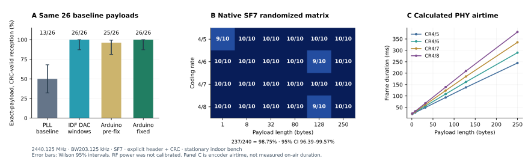

<p align="center"></p>

# ESP32 LoRa SDR

**Send a complete 2.4 GHz LoRa packet using the RF already inside an ESP32-S3.**
The sender needs no external LoRa transceiver. An independent LR2021 receives
the bytes and checks the packet CRC.

[English quick start](docs/quick-start.md) · [中文说明](README.zh-CN.md) ·
[Measured results](docs/test-report.md) · [API](docs/api.md) · [Prior art](docs/prior-art.md)

This is an **experimental radio library**, tested on a Seeed XIAO ESP32-S3.
It uses undocumented RF registers and SDK PHY routines. The measured bench
profile is 2440.125 MHz, 203.125 kHz bandwidth, SF7, private sync `0x12`.
Read the capability table before choosing other settings.

## What is real today?

| Capability | Evidence / limit |
|---|---|
| XIAO → LR2021 complete packet | Independent hardware CRC and exact-byte comparison |
| On-device coding and transmission | Arduino / PlatformIO; the PC supplies payload bytes, not an I/Q waveform |
| SF7, four coding rates, 1–250 bytes | **237/240** in the completed randomized matrix (98.75%); 26/26 in the CR4/8 regression, including English and Chinese |
| Portable PHY encoder | 264/264 on-device cross-checks: SF7–12, CR4/5–4/8, lengths 1–255; this is **coding verification**, not RF verification |
| RF parameter selection | Frequency, preamble, coding rate, frequency correction, DAC amplitude and waveform window; unsupported combinations return an error |
| SF8 / SF9 transmission | Experimental; current windowed-DAC trials have failed on LR2021 despite valid timing |
| Receive on XIAO | Separate ESP-SDR I/Q capture + **PC** decoder path; native Arduino packet RX is not implemented |
| Calibrated TX power, distance or sensitivity | Not measured; raw gain and amplitude are not dBm |

The measurements are from one stationary indoor board pair. Failed tests,
resets and mismatched packets stay in the report.



## Your first packet

Use [SendOnce](examples/SendOnce/SendOnce.ino) or the USB
[SerialBench](examples/SerialBench/main.cpp). No sketch in this project sends
automatically at boot: type a command to start a bounded transmission.

```cpp
#include <LoRaSDR.h>
#include <ESP32S3Radio.h>

lora_sdr::ESP32S3Radio radio;
lora_sdr::Config config;

// After radio.begin() returns Ok:
config.transport = lora_sdr::Transport::DacWindows;
config.spreadingFactor = 7;
config.codingRate = 4;                 // 4/8
const uint8_t message[] = "Hello from XIAO!";
lora_sdr::TxResult result;
auto status = radio.transmit(message, sizeof(message)-1, config, result);
// status reports the TX operation. Only the independent receiver proves delivery.
```

PlatformIO:

```sh
pio run -e xiao-s3
pio device list
pio run -e xiao-s3 -t upload --upload-port YOUR_PORT
pio device monitor --port YOUR_PORT --baud 115200
```

Then enter `INFO`, `DAC`, and
`TX 7 4 48656c6c6f2066726f6d205849414f21`. Configure the LR2021 receiver
to the matching profile and look for **CRC OK + the exact same hex bytes**.
The +15 kHz correction in the defaults was measured for one bench pair; it is
not a calibration value for every ESP32.

## How it works

The PHY encoder creates the header, whitening, payload CRC, Hamming coding,
diagonal interleaving and Gray-mapped symbols. The S3 backend keys its internal
2.4 GHz RF chain and plays I/Q windows from RF SRAM at 40 MS/s.

The current DAC waveform includes silent gaps between symbol windows. For the
default SF7 profile, 15,000 of about 25,206 samples are played per full up-chirp
(about 59.5%). This is **not continuous, gap-free LoRa transmission**. There
is also a PLL modulation backend for research and comparison; its randomized
payload reliability is lower on this bench.

## Reproducibility and credit

Research builds, seeds, payload hex, received hex, CRC results, timing failures
and firmware hashes accompany the measurements. The test report distinguishes
host-generated waveforms from native Arduino transmission and software checks
from independent RF tests.

This project follows earlier work by [ESPARGOS](https://github.com/ESPARGOS/esp-sdr),
[Jochen Hammes](https://github.com/jochenhammes/esp32-sdr-trx/tree/research/iq-tx)
and [CNLohr](https://github.com/cnlohr/lolra). **It is not presented as the first
firmware-generated LoRa transmitter.** Their failed experiments are useful
engineering evidence; [our prior-art notes](docs/prior-art.md) explain what
was reused and what was measured here.

GPL-3.0-only. See [LICENSE](LICENSE) and [third-party notices](THIRD_PARTY.md).
Use RF settings permitted for your location and connected hardware.
