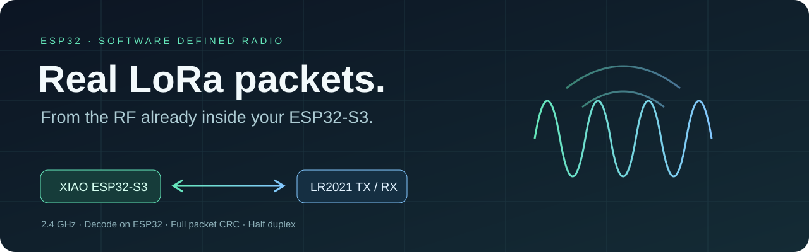
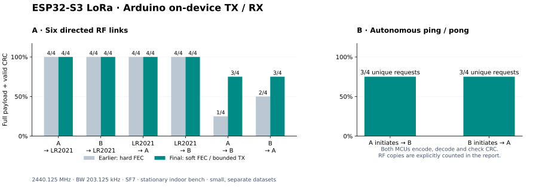

<p align="center"></p>

# ESP32 LoRa SDR

用 ESP32-S3 自带的射频收发 2.4 GHz LoRa 包。
编码、解调、纠错和 CRC 都在板子上运行，无需外接 LoRa 芯片。

[英文](README.md) · [开始使用](docs/arduino-rx.zh-CN.md) · [API](docs/api.md) ·
[测试结果](docs/arduino-report.zh-CN.md) · [已有工作](docs/prior-art.md)

## 开始使用

准备一块带 8 MB flash、8 MB OPI PSRAM 的 XIAO ESP32-S3，接好 2.4 GHz
天线。对端可以是另一块运行本项目的 ESP32，或参数匹配的 2.4 GHz LoRa 电台。

**收发请使用随附的 PlatformIO 工程。Arduino IDE 目前只能发射**，安装库 ZIP
不会启用接收。只需要发射时，可按 [Arduino IDE 步骤](docs/quick-start.md) 操作。

下载仓库 ZIP 并解压，或用自己的 GitHub 账号克隆。Windows 建议放在
`C:\lora-sdr`。在包含 `README.md` 和 `platformio.ini` 的目录打开终端：

```sh
python -m pip install platformio==6.1.19
python examples/NativeDuplex/setup_deps.py
pio run -d examples/ArduinoDuplex -e xiao-arduino-rx
pio device list
```

从列表找到板子的串口，替换 `YOUR_PORT`，刷入并打开日志：

```sh
pio run -d examples/ArduinoDuplex -e xiao-arduino-rx -t upload --upload-port YOUR_PORT
pio device monitor --port YOUR_PORT --baud 115200
```

程序开始监听。对端设置为 **2440.125 MHz、BW 203.125 kHz、SF7、preamble
16、sync `0x12`、显式包头和 payload CRC**。收到包后，日志显示
`ARDUINO_RX crc_ok=1` 和完整字节。

有两块 ESP32 时，先按 [ping/pong 步骤](docs/arduino-rx.zh-CN.md#两块-esp32-对传)
发送请求并收到回复，再改参数。

## 写自己的程序

修改 [`examples/ArduinoDuplex/main/main.cpp`](examples/ArduinoDuplex/main/main.cpp)。
在 `setup()` 初始化，在 `loop()` 调用收发。
[指南中的完整接收程序](docs/arduino-rx.zh-CN.md#写自己的程序) 可以直接放进这个文件。

`radio.begin(settings)` 成功后，主要调用是：

```cpp
Error status = radio.transmit("Hello from ESP32-S3!");

RxPacket packet;
status = radio.receive(packet, 500);
if (status == Error::Ok) {
    Serial.write(packet.payload, packet.length);
}
```

`receive(packet, 500)` 采集 500 ms 后解码。`transmit()` 返回 `Ok` 表示本机
完成发射，是否送达要看对端。

频率用 MHz，带宽用 kHz，编码率填 `5`、`6`、`7`、`8`，对应 4/5 到 4/8。
先用 SF7、编码率 `8`。功率是 1–100 的相对设置，不是 dBm。
其他参数和错误码见 [API](docs/api.md)。用 `app_main()` 的 ESP-IDF 程序可参考
[NativeDuplex](docs/native-guide.zh-CN.md)。

## 真实验证到的能力

| 操作 | 已测范围与边界 |
|---|---|
| Arduino ↔ LR2021 | 两块 ESP32 分别收发，四条方向 **16/16**：SF7，CR4/5、4/8，8／32 字节。 |
| ESP32 ↔ ESP32 | 主机调度的单包 **6/8**，四个 CR4/8 样本全通过；交换发起角色的两轮自主对传各 **3/4** 个独立往返，每请求／回复的 8 个 RF 副本单独计数。 |
| Arduino 发射 | SF7、CR4/5–4/8、1–255 字节，严格 CRC＋逐字节 **18/20**；四种 CR 的 255 字节全部通过，漏包保留。 |
| Arduino 接收 | 203.125 kHz，SF7–12 各一个新 8 字节包，**6/6**；四项负例拒收。这是短包 smoke。 |
| 无电脑指令 Arduino echo | 板上收到 **8/8**；LR2021 严格收到完整 ACK **8/8**，没有 ESP32 串口指令。 |
| 参数 | 频率、SF、CR、带宽、前导码、sync、相对发射幅度和频偏修正；[支持范围](docs/native-guide.zh-CN.md)。 |



上述是固定室内三板的不同批次，不能合并成可靠率或距离保证。
[Arduino 报告](docs/arduino-report.zh-CN.md) 保留完整载荷、失败、IRQ/CRC 判据、
固件哈希和图表。中间版本曾输出一个 CRC 有效但字节错误的包，自主发起端
拒绝了对应回复；需要更强完整性的应用应另加 checksum 或认证封装。
[旧原生报告](docs/native-report.zh-CN.md) 和 [早期报告](docs/test-report.zh-CN.md) 另存 Arduino 发射及电脑 IQ
解码实验，不能当作原生收包结果。

接收是 50–900 ms 有限采集窗口，250 kcomplex samples/s，随后在 ESP32 内处理。
半双工，解码期间有盲区，高 SF 可能耗时数十秒。SF8/9 发射不可靠，SF10–12
发射未支持。Wi-Fi/BLE 共存、校准 dBm、连续接收、CAD 和 LoRaWAN 尚未实现。

## 可选调试工具

串口 bench 可以配合网页显示双板发包、完整字节和 CRC。
[网页实测证据](docs/native-report.zh-CN.md) 只作为调试展示；库本身、独立接收
和 echo 示例都不依赖网站。电脑仅用于安装、编译、刷机和可选查看日志。

## 原理与来源

编码器生成显式包头、payload CRC、白化、纠错、交织和 LoRa 符号；底层通过
ESP32-S3 内部 2.4 GHz 射频播放 I/Q 窗口，接收 IQ 存入 PSRAM，由 C++ 完整解码。
当前 DAC 发射符号间有静默间隙，不能宣称连续无损波形。

参考 [ESPARGOS](https://github.com/ESPARGOS/esp-sdr)、
[Jochen Hammes](https://github.com/jochenhammes/esp32-sdr-trx/tree/research/iq-tx)
和 [CNLohr](https://github.com/cnlohr/lolra)，不宣称世界首创。
[调研记录](docs/prior-art.md) 说明参考实现和失败方法。许可 GPL-3.0-only，
[第三方声明](THIRD_PARTY.md)。使用符合所在地要求与硬件条件的射频设置。
