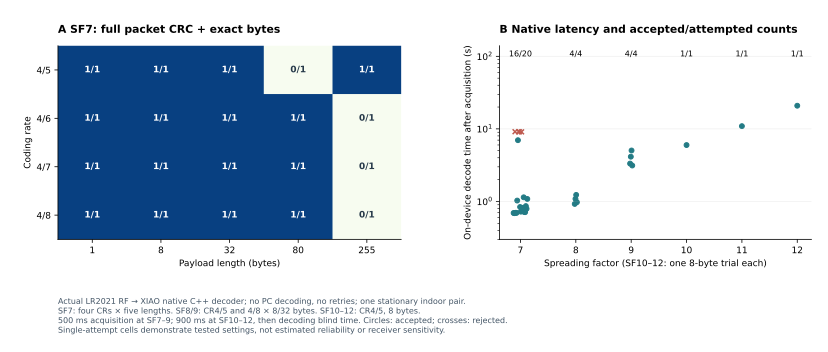
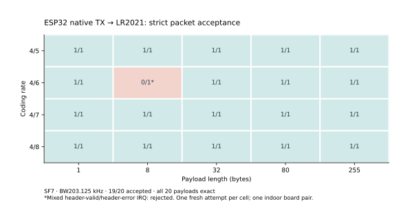
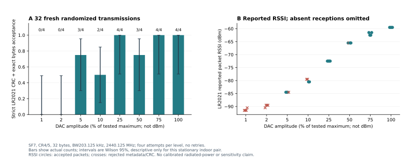

# Full packets on the ESP32: native RX/TX measurements

7 October 2026, Hong Kong time. This is an engineering measurement report,
not a published paper or a universal radio-compatibility claim.
[中文摘要](native-report.zh-CN.md) · [Build and use the library](native-guide.md)

## What runs on the board

The XIAO performs RF acquisition, filtering, synchronization, dechirping,
symbol recovery, explicit-header validation, FEC, dewhitening and payload
CRC in C++. Its `LoRaRadio` object also constructs and transmits packets.
Expected payload bytes are **never supplied to the receiver's decoder**.
The host fixtures compare independently generated bytes only after the
ESP32 returns a complete CRC-valid packet.

The autonomous `NativeDuplex/xiao-echo` program provides a stronger boundary
check: it receives a packet and sends `ACK:` plus those bytes using its own
`radio.send()`. The fixture writes **zero serial commands to the XIAO**.
It controls the independent LR2021 and records both consoles.

## Hardware, profile and acceptance gates

One stationary indoor pair, unchanged antennas, no controlled attenuation
or calibrated power meter:

- Seeed XIAO ESP32-S3, rev0.2, 40 MHz crystal, 8 MB flash and 8 MB OPI PSRAM.
- AeroLink ESP32-S3 + LR2021, the verified HF 2.4 GHz path, public RadioLib 7.7.0.
- 2440.125 MHz, BW203.125 kHz, 16-symbol preamble, sync `0x12`, explicit header,
  mandatory payload CRC. LR2021 TX requests −12 dBm; actual radiated power was
  not measured. Native XIAO TX uses relative DAC amplitude and a +15 kHz
  correction measured for this pair.
- RX accepts only complete bytes whose native payload CRC is valid, with an
  exact comparison against the fixture's independently generated payload.
- LR2021 reception also requires RX_DONE, HEADER_VALID, no header/payload CRC
  error IRQ, successful read/header APIs, CRC present and exact length/bytes.
  A mixed valid/error IRQ is retained and rejected even with matching bytes.

`send()` returning `Ok`, a spectrum peak or an identical-looking chirp is
insufficient delivery evidence. Runs use fresh seeded payloads and no hidden
RF retries. Separate seeds/builds are separate observations, not paired
sensitivity comparisons.

## Native receive progression

| Checkpoint | Actual outcome | Raw evidence |
|---|---|---|
| First 16-bit capture pipeline | 0/12 packets; capture continuity failed | [Failed run](../evaluation/data/native-rx-sixteen-bit.json) |
| 4-bit finite-window decoder | 12/12, SF7/8/9 × CR4/5,4/8 × 8/32 bytes | [RF attempts](../evaluation/data/native-rx-four-bit.json) |
| Actual library `receive()` | 12/12 with the same configuration grid | [API attempts](../evaluation/data/native-rx-api.json) |
| Broader 4-bit matrix | 27/31 packets; all four negative checks rejected | [Buffered fixture](../evaluation/data/native-rx-matrix-buffered.json) |
| Fractional-peak-only experiment | 21/31; all four negatives rejected | [Retained experiment](../evaluation/data/native-rx-fractional.json) |
| Final 8-bit acquisition / bounded peak alternatives | **27/31** packets; all four negative checks rejected | [Final RF attempts](../evaluation/data/native-rx-eight-bit.json) |

The first broad matrix was aborted at a 255-byte USB control command: the
LR2021's original small input queue truncated a long pasted hex string.
[Its eight completed cases](../evaluation/data/native-rx-matrix.json) remain
separate. The public companion now allocates a 1024-byte RX queue, and the
fixtures pace long control commands. Neither change alters the RF payload.

The final native pipeline acquires 16 Mcomplex samples/s internally, mixes
and decimates by 64, and retains **250 kcomplex samples/s, 8-bit I and 8-bit Q**
in PSRAM. Native FIR batching uses 2048 input samples and its 128-tap profile.
Every saved frame's CRC, sequence and sample index must be contiguous before
I/Q enters the decoder. Missing samples are never replaced with zeros.

The earlier successful API run had one capture that stopped at a boundary
with status4, retaining 111,047 contiguous samples rather than the full
requested window. The complete packet in that prefix passed CRC. Therefore
12/12 packets did **not** mean 12/12 fully retained acquisition windows.
Capture status, drops and abandoned units remain visible in `lastReceive()`.

Long-packet experiments exposed premature symbol rounding. Fractional peak
positions now survive until CFO/SFO correction, following the ordering in
[LoRaPHY](https://github.com/jkadbear/LoRaPHY/blob/master/LoRaPHY.m).
Because fractional-only decoding lost some earlier passes, the final code
keeps a second quantized-peak hypothesis. There are five bounded timing/fold
hypotheses; each tries at most two symbol conversions, and every acceptance
still requires the entire CRC. No payload-specific correction is attempted.
The final build also delays serial `RXPACK READY` until RF tuning/calibration
has finished. Native applications need no serial handshake.

The matrix has one attempt per configuration: four coding rates and lengths
1/8/32/80/255 at SF7; CR4/5 and 4/8 with 8/32 bytes at SF8/9; and one 8-byte
CR4/5 attempt at each of SF10–12. A tested high SF is not a reliability or
sensitivity estimate. The raw file preserves every rejected setting.

Final results: SF7 **16/20**; SF8 **4/4**; SF9 **4/4**; SF10, SF11 and SF12
**1/1 each**, all three using 8-byte CR4/5 packets. At SF7 every 1/8/32-byte
case passed, 80-byte cases passed 3/4, and 255-byte cases passed 1/4. The
rejected cases were 80-byte CR4/5 and 255-byte CR4/6,4/7,4/8. All 35 acquisition
windows reported captureStatus0, zero dropped/abandoned units and contiguous
frames, so those four failures were not reported capture gaps. Their exact
RF/demodulation cause remains unresolved. **Use short packets first.**
SF10/11/12 decode times in this run were about 6.0/10.9/20.9 seconds after
the 900 ms acquisition. The multiple changes and new random payload seed
do not establish which change improved any individual configuration.

## Real negative RF checks

Each broad matrix includes:

1. No fixture RF during the receive window.
2. A real LR2021 packet with payload CRC disabled.
3. A real packet with mismatched sync `0x34`.
4. A 255-byte CR4/8 packet and a 100 ms window that cannot contain its payload.

No packet may be returned for these checks. A valid explicit header alone is
insufficient. Separately, the same C++ decoder runs on saved real SF7/8/9 I/Q,
with truncated prefixes, all-zero input and seeded noise rejected. Portable
codec regression covers 144 SF/CR/length round trips, truncated symbol lists
and 24 deliberately changed payload-CRC cases. Those are software checks,
not additional RF trials.

## Half duplex and autonomous replies

[The alternating single-firmware run](../evaluation/data/native-alternating.json)
gave **12/12 native RX and 10/12 strictly accepted XIAO TX**, without reflashing
or resetting between directions. One transmission had exact bytes but a
mixed header-error IRQ; another had a payload CRC error and changed bytes.
Both stay failed. Before this fix, RadioLib's short TX payload-length setting
silently limited subsequent RX; restoring `explicitHeader()` after TX fixed
that receiver-state bug. The earlier unsuccessful diagnostic attempts remain
in `evaluation/data/native-tx-*.json`.

The standalone PlatformIO receive-and-reply experiment initially failed:
SRAM queue 0/8, PSRAM queue 0/8, fresh-window markers 0/8, and an IRAM reset
change alone 0/1. The successful change increased the native FIR batch/tap
processing margin; its first fresh test passed 1/1 in both directions.
[That exact-byte, hardware-CRC ACK](../evaluation/data/native-echo-fir2048-smoke.json)
demonstrated standalone library operation. It did not establish reliability.

The subsequent [eight-case run](../evaluation/data/native-echo-final.json)
recorded 7/8 native RX lines and 6/8 combined ACK gates. Its raw UART output
also shows one truncated `NATIVE_RX` label and one missing ACK console line
despite an independently accepted ACK. Those recorded counts are unchanged.
The fixture now buffers partial serial lines across timeouts.
A [new CR4/8, 75% run](../evaluation/data/native-echo-robust.json) recorded
7/8 native RX, 3/8 combined gates and 5/8 independent valid ACKs. Two missing
ACK console labels and two rejected mixed-header IRQs explain part of that
gap; the remaining trial had no native packet. Do not promote exact bytes
from rejected IRQ events into successful delivery.

The earlier [8-bit standalone receive-and-reply run](../evaluation/data/native-echo-eight-bit.json)
gave **8/8 native full-packet RX**, **5/8 independently accepted exact ACKs**
and **4/8 combined console-plus-RF gates**. Three local ACK console labels
were absent, including one independently accepted ACK. Three other ACKs had
exact bytes but mixed header-valid/header-error IRQs and stay rejected under
the strict RF rule. All eight returned ACK payloads matched, but exact bytes
alone are not the acceptance rule. The raw file contains the actual XIAO
app hash `f7b6b843…` (664,160 bytes, ESP-IDF6.0.1) and LR2021 hash
`a46cbeac…` (320,928 bytes). Its returned bytes came from actual on-device
reception, not from a host copy of the expected payload. `fflush()` and a
20 ms delay around TX did not eliminate all short ACK console omissions;
  that telemetry limitation remains unresolved.

A separate [fresh eight-case standalone application check](../evaluation/data/native-echo-library-settings.json)
exercised the new `begin(LoRaSettings)`, `receive()` and `transmit()` API on
the board, with zero serial writes to the XIAO. Native RX was **8/8**;
independent strict ACK reception was **5/8**; the original combined
console-plus-RF score was **3/8**. All eight ACK payload readouts matched,
but two had mixed header-error IRQ `00040370` and one had payload CRC error
IRQ `00440170` / read status −7; those three are rejected. Five local ACK
console labels were missing, including two independently accepted replies.
This run is not pooled with the earlier echo run.

The new application was built from source `cd10e910…` with ESP-IDF6.0.1:
664,192-byte app SHA256 `dc4cac234c78a24dd873a8bc4bb466ab10049e887f891746de936f06d6c61a67`.
The [generated build identity](../evaluation/data/native-library-build.json)
also records bootloader/partition inputs and five successful local example
builds. LR2021 still ran the independently identified `a46cbeac…` app. The
SDR board was then restored to the previously measured SDK6.2 serial bench.
This verifies standalone API use; it does not resolve the remaining RF or
console reliability failures.

## Native TX parameters and receiver epochs

The native serial API was checked with [20 fresh shuffled RF attempts](../evaluation/data/native-tx-rearmed.json),
seed202610071208: SF7, all four CRs, and lengths1/8/32/80/255. **19/20** passed
the unchanged strict LR2021 gate; **20/20** payloads matched. All four 255-byte
packets passed. The rejected CR4/6, 8-byte attempt returned exact bytes but
IRQ`00040370`. Its pre-rearm IRQ was zero, so old idle flags do **not** explain
every mixed-header event. No retry was made. One observation per setting is
a functionality check, not a reliability estimate. Actual app hashes are
XIAO`94238ac7…`/694,800 bytes and LR2021`a46cbeac…`/320,928 bytes.

The simple UI initially had [five forward rejections and one native RX success](../evaluation/data/native-web-sdk62.json)
with the SDK6.2 app. Changing only the bench toolchain did not solve the issue:
the first [SDK6.0.1 forward attempt also failed](../evaluation/data/native-web-sdk60-no-rearm.json).
The bridge now records the receiver's pre-existing IRQ state, starts a fresh
matching RX interval before each manual XIAO packet, and preserves the same
strict packet gate. It supplies payload bytes to TX and displays MCU packet
results; it performs no packet demodulation or I/Q upload.

[Two fresh SDK6.0.1 messages](../evaluation/data/native-web-sdk60-rearmed.json)
then passed, one in each direction. Before the successful forward packet,
INFO recorded IRQ`00000320`; the accepted packet recorded`00040170`.
Restoring the **same SDK6.2 binary** used in the initial failed run also gave
[one forward and one reverse success](../evaluation/data/native-web-sdk62-rearmed.json).
This supports scoping receiver state to each test interval; it does not prove
that every earlier header-error flag was stale. An unsolicited mismatched
E-only receiver readout was never counted as delivery of a sent packet.
All failures and snapshots remain available; the builds/runs are not pooled.

After restoring SDK6.2, the [final optional UI check](../evaluation/data/native-web-final.json)
used four fresh messages: an 80-byte forward payload, a 20-byte native reverse
payload, then fresh 10-byte/14-byte packets after a page reload. All four
matched complete bytes and passed their independent/native CRC gates. These
four attempts are separate from the 20-setting matrix. The last reload also
verified connected Send/Disconnect controls after both directions completed.

The [optional UI proof](assets/native-live-proof.png) shows both receiving boards,
complete bytes and CRC. A computer can display this optional bench UI; the
standalone library and echo program perform packet processing on the ESP32.

The application API also provides `begin(LoRaSettings)`, atomic
`configure(LoRaSettings)` and RadioLib-style `transmit()` text/binary overloads;
existing `send()` calls remain equivalent. Application configuration and
dispatch regressions cover invalid profiles preserving prior settings,
embedded-zero bytes, propagation of backend failures and unsupported RX.
Those host-side API checks claim no additional RF success. The retained RF
datasets identify their original image hashes; newer wrapper code does not
retroactively change those measured firmware identities.

## Relative TX level

`setTransmitPowerPercent(1..100)` selects DAC amplitude 2..200. It is a useful
repeatable control, **not a calibrated antenna-power setting in dBm**.
[32 randomized SF7, CR4/5, 32-byte attempts](../evaluation/data/native-levels-run2.json)
gave 20/32 strict receptions:

| Relative level | Accepted / attempted |
|---|---|
| 1%, 2% | 0/4 at each |
| 5% | 3/4 |
| 10% | 2/4 |
| 25% | 4/4 |
| 50% | 3/4 |
| 75%, 100% | 4/4 at each |

Reported packet RSSI spanned approximately −91.5 to −59.5 dBm. These four
attempts per level, shown with descriptive Wilson intervals, are too small
to establish a monotonic packet-error curve. Missing packets have no packet
RSSI and are not assigned invented values. The initial
[failed preflight](../evaluation/data/native-levels.json) emitted zero RF
attempts and is not counted as a sensitivity failure.

The requested weak-signal demonstration in which raising TX SF restores
delivery remains **unachieved**: native DAC SF8/9 TX is unreliable, and
SF10–12 TX returns `Unsupported`. Native high-SF RX success cannot substitute
for a controlled high-SF TX recovery experiment. No range, link-budget or
Multi-SF diversity advantage is claimed.

## Builds, reproducibility and current boundaries

The subsequent [library API CI run37571334340](https://github.com/jimmywuhkust/esp32-lora-sdr/actions/runs/37571334340)
succeeded for `cd10e910…`: Arduino2m45s, recorded-IQ/native-C++ and API
regressions22s, all three native PlatformIO environments8m20s, total8m24s.
[Its exact source/run metadata](../evaluation/data/native-library-ci.json)
is retained separately. The new local standalone RF check above used that
application source, not a CI-generated or unrelated older image.

GitHub [CI run37567375722](https://github.com/jimmywuhkust/esp32-lora-sdr/actions/runs/37567375722)
succeeded for source commit`d590a708…`: Arduino2m39s, recorded-IQ/native-C++
regressions23s, native PlatformIO7m38s, total7m42s. The native job builds
`xiao-native`, `xiao-echo` and the new `xiao-bench` with ESP-IDF6.0.1.
[Recorded CI metadata](../evaluation/data/native-ci.json) distinguishes
these compile/regression checks from live RF measurements.

The public [native bench manifest](../firmware/iq-capture/prebuilt/native/manifest.json)
identifies the exact generated app/bootloader/partition hashes, source-file
hashes, SDK/DSP pins and compiler. Generated images contain no device NVS
readback. The serial bench uses the pinned ESP-IDF 6.2 development checkout;
the standalone PlatformIO component uses espressif32@7.0.1 / ESP-IDF 6.0.1.
Record the actual last-flashed image, not an unrelated subsequent build.
Earlier development rounds without saved image hashes are identified as
such; a new image hash is not assigned to an older measurement.

- Stock Arduino core 2.0.17 supports TX; its native `receive()` remains
  `Unsupported`. Full packets in both directions use the supplied PlatformIO
  ESP-IDF component, PSRAM configuration and reserved RF SRAM layout.
- Acquisition windows are 50–900 ms, followed by decode blind time. SF7 short
  packets take roughly a second to process; SF11/12 can take tens of seconds.
  This is not continuous listening, full duplex or a streaming 4 MS/s USB SDR.
- Native RX bandwidth is 203.125 kHz. TX SF7 also has earlier independently
  measured 406.25/812.5 kHz profiles; they are separate historical matrices.
- No Wi-Fi/BLE coexistence, implicit-header RX, LoRaWAN stack, calibrated TX
  dBm API, proven channel-activity detection or guaranteed high-SF TX.
- The DAC TX has gaps between symbol windows. The earlier SRAM streaming
  investigations and their failures remain separate research backends.

Run [the portable C++ regressions](../tools/test_native_decoder.py), build
both native example environments, then follow the
[public fixture instructions](../evaluation/README.md). CI builds and saved
I/Q tests provide reproducibility checks; only the raw hardware datasets
establish the RF outcomes described here.
