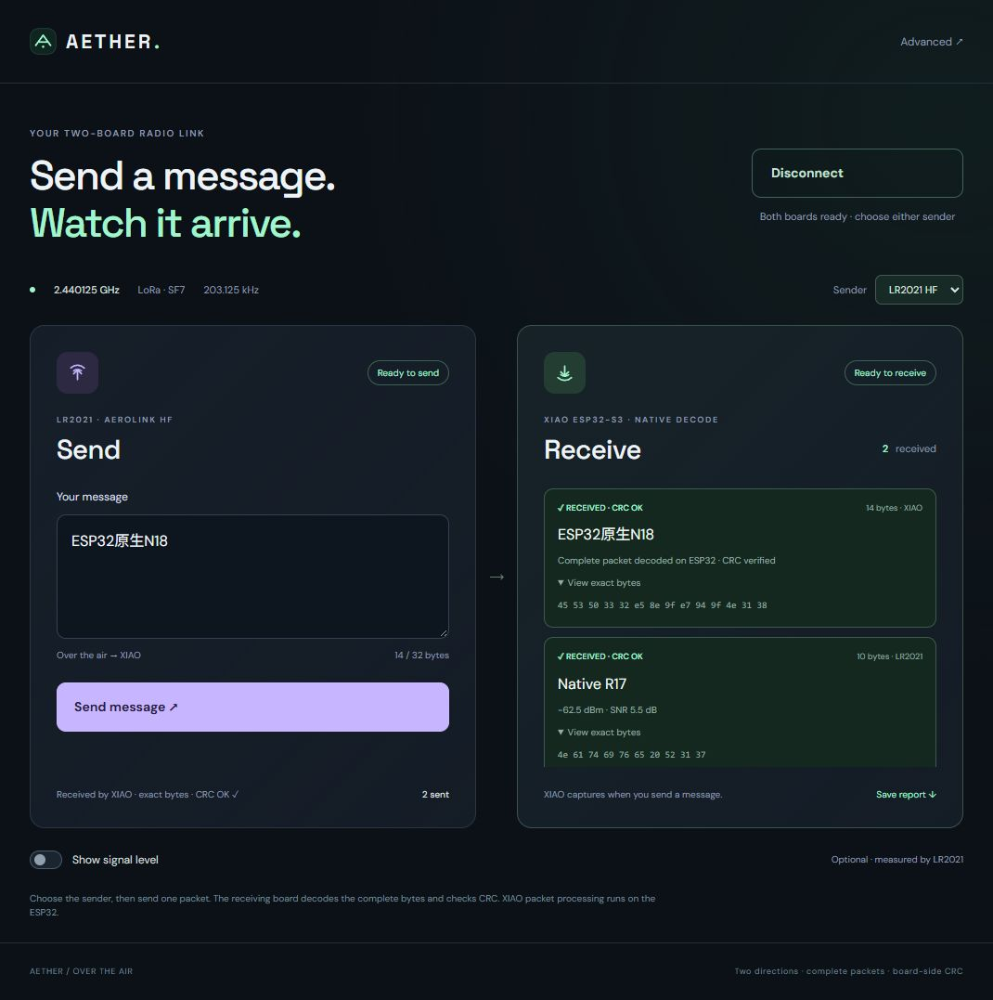

# ESP32 自己收发完整 LoRa 包：原生实测报告

2026 年 10 月 7 日。完整方法、原始记录和固件版本见
[英文报告](native-report.md)，入门见[中文步骤](native-guide.zh-CN.md)。

**电脑不解包。** XIAO 上的 C++ 库完成采集、同步、解调、包头、纠错、
去白化和 payload CRC。`receive()` 返回完整字节，`send()` 在同一块 ESP32
上编码并通过自带 2.4 GHz 射频发送。独立 LR2021 是另一端的收发器。

## 当前测到的结果

| 测试 | 结果与证据 |
|---|---|
| 第一版 16-bit 原生采集 | 0/12，采集连续性失败；记录保留 |
| 4-bit 原生整包解码 | SF7/8/9、CR4/5 与 4/8、8/32 字节：12/12 |
| 真正库接口 `receive()` | 同一配置网格：12/12；其中一次仅保留连续窗口前缀，整包仍完整 |
| 同一固件交替收发 | 原生接收12/12，XIAO 发给 LR2021 严格验收10/12；两次失败保留 |
| 早一轮8-bit独立回包例程 | XIAO原生接收8/8，LR2021严格接受ACK5/8，额外要求本地ACK日志则4/8 |
| 新配置接口独立回包例程 | XIAO原生接收8/8，独立严格ACK5/8，额外要求本地ACK日志则3/8；另一组新载荷，不合并 |
| 最新 8-bit I/Q 参数矩阵 | **27/31 完整包**；SF7 16/20，SF8 4/4，SF9 4/4，SF10/11/12各1/1 |
| 最新真实 RF 拒收测试 | 无测试发射、没有 payload CRC、错误 sync、截断窗口：**4/4 正确拒收** |
| 发射强度随机测试 | 8档×4次：20/32严格通过，最低1%、2%各0/4；这不是校准功率或灵敏度测量 |

最新矩阵：[完整原始 JSON](../evaluation/data/native-rx-eight-bit.json)。
每个参数组合仅一次，不能当成该组合可靠性的估计。SF10–12各只有一个
8字节、CR4/5的测试包。SF7 的1/8/32字节全部通过，80字节3/4，255字节1/4。
失败是80字节CR4/5，以及255字节CR4/6、4/7、4/8；35次窗口均报告无采集
丢弃且帧连续，具体射频/解调原因尚未解决。**先使用短包。**


## 它是否真的能脱离电脑解包？

`NativeDuplex/xiao-echo` 是独立 PlatformIO 应用：收到 CRC 正确的包后，
在板上取收到的字节，直接调用库回发 `ACK:` 加这些字节。测试程序只读取
XIAO 的日志，**对 XIAO 的串口写入为零**。LR2021 已接收到字节完全一致、
硬件 CRC 和严格 IRQ 验收通过的 ACK。电脑既没有上传 I/Q，也没有给解码器
提示期待的 payload。

连续测试仍有丢包和混合包头错误 IRQ，不能把一次成功写成稳定100%。
早一轮[独立回包原始记录](../evaluation/data/native-echo-eight-bit.json)里，8个ACK
payload均一致，但3个存在混合包头错误IRQ，严格拒绝；另有本地ACK日志缺行，
其中一次对方已严格接收成功。上述5/8和4/8是不同验收条件，不能混用。
早期独立应用的0/8失败、IRAM修改单独失败、调整FIR批处理后的首次1/1，
以及后续每轮原始输出均保留在英文报告中。日志缺行与真正 RF 失败分别说明，
不修改旧轮次统计，也不把存在错误 IRQ 的相同字节强行记为成功。

## 库怎么用

```cpp
#include <LoRaRadio.h>
lora_sdr::LoRaRadio radio;
lora_sdr::LoRaSettings settings;
settings.frequencyMHz = 2440.125;
settings.spreadingFactor = 7;
settings.codingRate = 8;             // 4/8
settings.transmitPowerPercent = 75;  // 相对幅度，不是 dBm
// 放在应用函数内：
auto status = radio.begin(settings);
if (status != lora_sdr::Error::Ok) return;
status = radio.transmit("Hello from ESP32!");
lora_sdr::RxPacket packet;
auto result = radio.receive(packet, 500);
```

完整双向目前使用随仓库提供的 **PlatformIO ESP-IDF component** 和 PSRAM/
核心配置。普通 Arduino core2.0.17 例程已有这个简洁发送 API，但完整接收仍
返回 `Unsupported`。这点没有隐藏，也没有把电脑解码包装成 Arduino 接收。

## 新配置接口的独立应用验证

[新的八次独立应用验证](../evaluation/data/native-echo-library-settings.json) 直接调用
`begin(LoRaSettings)`、`receive()` 和 `transmit()`；电脑给XIAO的串口写入为零。
板上完整解包 **8/8**，LR2021独立严格CRC接受ACK **5/8**，额外要求本地ACK日志
的旧组合判据为 **3/8**。8个ACK的payload读数均一致，但两次有混合包头错误
IRQ`00040370`，一次有payload CRC错误IRQ`00440170`、读取状态−7，均拒收。
五个本地ACK日志缺行，包括两个对端已经严格接收的回复。与旧八次不合并。

新应用从源码`cd10e910…`构建，ESP-IDF6.0.1，664192字节，
SHA256`dc4cac234c78a24dd873a8bc4bb466ab10049e887f891746de936f06d6c61a67`。
[生成固件与本地构建记录](../evaluation/data/native-library-build.json) 保留输入镜像哈希；
五个例程环境本地均编译通过。LR2021仍为`a46cbeac…`固件；之后XIAO恢复到原先
已测的SDK6.2串口bench。这证明应用可独立调用新API，不能说明RF或日志失败已解决。

## 原生发射参数和接收状态

[新一轮20个随机载荷](../evaluation/data/native-tx-rearmed.json)覆盖SF7、四种编码率、
1/8/32/80/255字节：**19/20严格通过，20/20字节一致，四个255字节包全部通过**。
失败的是CR4/6的8字节包，IRQ`00040370`；发送前IRQ为零，所以不能把所有
混合包头错误都归因于旧状态。没有重发。每格一次，只证明这些尝试的结果，
不能作为普遍可靠性结论。


网页初始SDK6.2试验为[发射0/5、原生接收1/1](../evaluation/data/native-web-sdk62.json)，
换SDK6.0.1后的[第一次发射仍失败](../evaluation/data/native-web-sdk60-no-rearm.json)。
因此没有宣称换SDK解决了问题。现在每次手动发包前记录独立接收器IRQ并启动
新的接收区间，CRC/包头/完整字节判据不变。SDK6.0.1随后[双向各1/1](../evaluation/data/native-web-sdk60-rearmed.json)，
恢复原来**同一份SDK6.2固件**后也[双向各1/1](../evaluation/data/native-web-sdk62-rearmed.json)。
一次成功发射前已经有IRQ`00000320`，新包为`00040170`。这些观察支持按接收
区间管理状态，但不是所有历史错误的已证实根因。未匹配发送载荷的额外接收
读数未计为成功；所有失败和原始快照都保留。

[最后一组可选网页检查](../evaluation/data/native-web-final.json) 在恢复同一份SDK6.2固件后，
发送了80字节正向、20字节原生反向载荷；刷新页面后再用新的10/14字节载荷
各测一个方向，四次均完整字节相同且CRC通过。四次与20档参数矩阵分开统计。
刷新后也确认两次完成时 Send/Disconnect 按钮恢复可用。



应用接口另提供 `begin(LoRaSettings)`、原子配置 `configure(LoRaSettings)` 和
RadioLib 习惯的 `transmit()` 文本/二进制调用；原有 `send()` 仍等价。
配置与调度回归检查非法配置保留原设置、含零二进制载荷、底层错误传播和
不支持的接收返回。这些电脑上的API检查不算新增RF成功。射频数据仍保留
各自实测固件哈希，不把新封装代码的构建身份追溯套给旧实验。

新库接口源码`cd10e910…`的[云端CI](https://github.com/jimmywuhkust/esp32-lora-sdr/actions/runs/37571334340)
全部通过：Arduino2分45秒、录制IQ/原生C++/API回归22秒，三个原生PlatformIO
环境8分20秒，总计8分24秒。[独立CI元数据](../evaluation/data/native-library-ci.json)
记录精确源码与run。新八次独立应用使用该应用源码和本地生成镜像，而非旧固件。

此前源码`d590a708…`的[云端CI](https://github.com/jimmywuhkust/esp32-lora-sdr/actions/runs/37567375722)
全部通过：Arduino2分39秒、录制IQ/C++回归23秒、三个原生PlatformIO环境7分38秒。
新增`xiao-bench`串口例程，与独立应用使用相同ESP-IDF6.0.1及原生库。
编译通过与真实RF结果分开记录。

## 采样、功率和未完成的部分

最新原生采集从内部16 Mcomplex samples/s混频和64倍降采样，保留250 kcomplex
samples/s、8-bit I与8-bit Q到PSRAM。窗口50–900ms，随后板上解码；因此存在
接收盲区。SF7短包约一秒处理，最新SF10/11/12分别约6.0/10.9/20.9秒，加上
900ms采集。**没有声称全天连续采样、4 MS/s USB流或全双工。**


相对强度1/2/5/10/25/50/75/100%各4次，分别0/0/3/2/4/3/4/4次严格通过。
接收器报告RSSI约−91.5至−59.5dBm。每档次数很少，图中有Wilson区间；不能
把这当成校准发射dBm、距离或接收灵敏度。没有收到的包不编造RSSI。

高SF发射仍不可靠：SF8/9实验有失败，SF10–12发送返回 `Unsupported`。
所以“降低功率收不到、提高发射SF后恢复”的实验仍**未完成**。高SF原生接收
成功不能替代这个实验。连续接收、Wi-Fi/BLE共存、LoRaWAN、Multi-SF优势和
普通Arduino完整接收也没有宣称完成。

仓库包含源代码、公开LR2021 companion、英文/中文入门、原始成功与失败、
SVG/PNG/PDF图表及编译/真实录制I/Q回归检查。不存在“世界首个”的宣传；
[已有工作调研](prior-art.md)明确标出了来源。生成的固件带哈希、源码哈希和
依赖锁定，没有上传私有 AeroLink 源码、设备NVS读回或真实GNSS数据。
