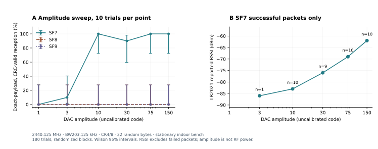
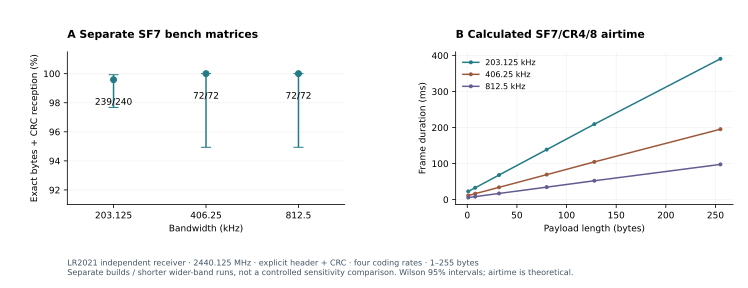
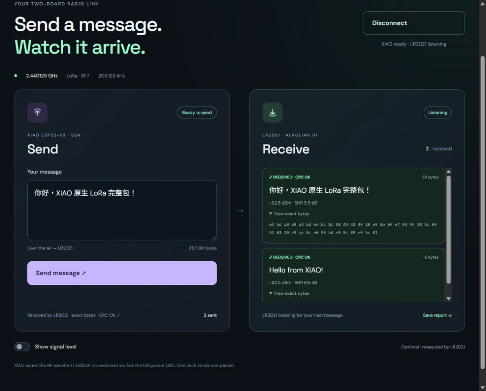
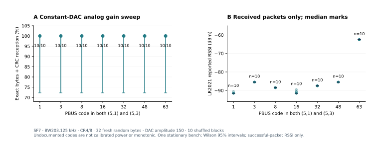

# Hardware test report — 7 October 2026

**Historical measurements. Arduino RX now exists in the dedicated
[ArduinoDuplex profile and new hardware report](arduino-report.md).**
TX-only / PC-decoder statements below describe their original snapshots.

**New: [full on-device RX/TX measurements](native-report.md).** The report
below retains the earlier Arduino TX and separate PC-IQ decoder experiments.
The native PlatformIO component now decodes complete CRC packets on ESP32;
stock Arduino full RX still returns `Unsupported`.

Updated through the final receiver IRQ audit on 7 October, Hong Kong time. This is a measured engineering report, not a
claim of universal compatibility or a peer-reviewed paper. Subsequent research
results must be appended with their own firmware hashes and denominators.


## Main result

Final stricter receiver audit: **224/240** accepted, **240/240** exact full
payloads. Sixteen mixed header-valid/header-error IRQ states are conservatively
rejected. [Read the final audit](#final-receiver-irq-audit-stricter-hardware-evidence)
before interpreting earlier API-based counts.

Earlier API-based public-receiver matrix: **239/240**, SF7, four coding rates and lengths
1–255 bytes; all forty 255-byte packets passed. Separate wider-band SF7
matrices passed **72/72 at 406.25 kHz** and **72/72 at 812.5 kHz**. The beginner
sketch passed **3/3** after a normal full PlatformIO upload. Later sections
identify each dataset and its firmware; the original matrix below is retained.
After the optional analog-control merge, its separate lowest-code regression
passed **72/72**, guards **18/18**, and default-gain bandwidth smoke tests
**3/3 each**. The newly rebuilt SendOnce example delivered **2/3**, with one
miss retained; the earlier 3/3 applies to the earlier image.
The later frequency/preamble/sync/polarity matrix delivered **142/144**;
both CRC failures are retained. Its rebuilt SerialBench default smoke was
**3/3**, with **24/24** configuration guards. A real reverse-link IQ recording
and PC decoder are now included for reproducibility; native Arduino RX remains
unimplemented. [中文测试摘要](test-report.zh-CN.md).

New reverse-direction result: the public LR2021 sends into the XIAO's internal
RF; the **PC** fully decodes104/108 fresh packets across SF7–9, four coding rates
and lengths1/8/32. The standalone public capture firmware and live fixture are
included. Per-SF counts33/36,35/36,36/36; four misses and74 windows with IQ
output drops remain visible. These are separate from XIAO transmission results.

早期 API 验收结论：公开接收器 239/240，覆盖 1–255 字节；两个更宽带宽批次各 72/72。
较早入门示例刷机后 3/3；最新重编译版本本轮 2/3，一次漏收保留。
模拟增益七档研究 70/70，最低档合入后回归 72/72；仍没有校准成 dBm。
SF8/SF9 的 PLL 路径有完整 CRC 包，但很不可靠；稳定高 SF、弱信号提高 SF
恢复和原生 Arduino 收包仍未实现，完整失败记录保留。

**A XIAO ESP32-S3 genuinely transmitted complete 2.4 GHz LoRa packets to an
independent LR2021, with matching full payload and hardware CRC.** The portable
encoder and RF modulation ran on the XIAO in the native Arduino build.

The completed randomized SF7 matrix achieved **237/240 packets (98.75%)**.
Its descriptive Wilson 95% interval is **96.39–99.57%**. All four coding rates
and lengths 1, 8, 32, 80, 128 and 250 bytes were tested, ten fresh payloads per
combination. No successful retransmission was substituted for a failed trial.
There were three misses; this result does not justify a 100% reliability claim.

中文结论：XIAO 已经能用自带射频发送完整 LoRa 包，LR2021 独立接收并通过 CRC。
完整随机实测为 237/240，覆盖四种纠错率和 1–250 字节；三个失败保留。
稳定 SF8/SF9、弱信号下提高 SF 的恢复效果、校准发射功率和原生 Arduino 完整接收，
在此快照中仍未具备，不能宣传为已完成。


[PDF figure](assets/baseline-results.pdf) · [PNG figure](assets/baseline-results.png) ·
[Plot source](../evaluation/plot_results.py) · [Raw matrix](../evaluation/data/native-matrix-basic.json)

## Test setup and success rule

| Item | Setup |
|---|---|
| Sender | Seeed XIAO ESP32-S3, revision 0.2, 40 MHz crystal, 8 MB flash / 8 MB OPI PSRAM |
| Receiver | Separate AeroLink ESP32-S3 + LR2021, HF port, HF lab firmware 2.9.18-hf2 |
| RF path | Connected antennas, stationary indoor bench, over the air |
| Channel / bandwidth | 2440.125 MHz / 203.125 kHz |
| Main PHY | SF7, 16-symbol preamble, sync0x12, explicit header, payload CRC required |
| Modulation | 40 MS/s RF SRAM DAC windows, amplitude150, up-window15000 samples |
| LO correction | +15 kHz, measured for this pair, not a universal calibration |
| Build | PlatformIO espressif32 7.0.1; Arduino core 2.0.17; XIAO S3 board profile |
| Matrix order | 10 randomized blocks, one of each parameter combination per block, seed20261007 |
| RF retries | None |
| Independent criterion | Fresh LR2021 RX event, CRC valid, full hex exactly equal to requested payload |

Spectrum energy, a detected preamble, a local TX-end line or a software round
trip alone never counts as successful reception. The receiver does not receive
the expected bytes as a decoding hint. Old serial events are discarded before
each transaction. Safe retries of idempotent settings are recorded separately
and do not retransmit RF.

## Completed matrix

Each cell reports successful packets / transmitted packets.

| Coding rate | 1 byte | 8 bytes | 32 bytes | 80 bytes | 128 bytes | 250 bytes |
|---|---:|---:|---:|---:|---:|---:|
| 4/5 | 9/10 | 10/10 | 10/10 | 10/10 | 10/10 | 10/10 |
| 4/6 | 10/10 | 10/10 | 10/10 | 10/10 | 9/10 | 10/10 |
| 4/7 | 10/10 | 10/10 | 10/10 | 10/10 | 10/10 | 10/10 |
| 4/8 | 10/10 | 10/10 | 10/10 | 10/10 | 9/10 | 10/10 |

LR2021 aggregate counters changed by +237 CRC-validated packets and +2 CRC
errors, with no missing-CRC acceptances, invalid metadata or host drops.
These aggregate counters do not identify the exact mechanism of every miss.
Successful packet RSSI was approximately −62 dBm on this bench; that is the
receiver's reported signal level, not calibrated XIAO output power.

The complete-frame airtimes in panel C come from the encoder, including
preamble, synchronization, header, FEC and payload. They are calculated PHY
durations; they are not a measured RF duty cycle or application throughput.

## Same-payload regression and coding checks

| Experiment | Result | Interpretation |
|---|---:|---|
| Host PLL, SF7, CR4/8 | 13/26 | Complete packet successes exist, but general payload reliability was poor |
| Host DAC windows, SF7, CR4/8 | 26/26 | Corrected DAC configuration, real independent LR2021 reception |
| Native Arduino DAC before SFD timing fix | 25/26 | Chinese 30-byte payload missed; one late symbol boundary |
| Native Arduino DAC after SFD pre-staging | 26/26 | Same payloads, including the Chinese packet, zero late boundaries |
| Native encoder cross-check | 264/264 | SF7–12 × CR1–4 × eleven lengths; **no RF was emitted by this check** |

The 26-payload set contains three random binary payloads at lengths 1, 2, 3,
8, 17, 32, 64 and 80, plus English16 and Chinese30. The method comparison uses
that same set. Firmware and uncalibrated RF levels changed, so these bars are
development regressions, not a controlled sensitivity comparison.

Encoder lengths are 1, 2, 3, 8, 17, 32, 64, 80, 128, 250 and 255 bytes.
The independent pinned reference omits a one-byte CRC special case; that case
was corrected using the separately pinned lora-phy CRC convention and recorded
in the cross-check JSON. Matching another implementation does not prove every
packet mode matches a commercial radio.

## Failures that changed the implementation

1. **Wrong DAC control assumptions.** Bit19 holds playback; it does not repeat
   it. The count is length-minus-one. Disabling the tone must preserve the keyed
   RF chain. These facts were learned from the earlier 0BSD investigation and
   then checked on this board. The failed probes were not LoRa interop successes.
2. **Arduino SDK initialization.** Stopping/deinitializing Wi-Fi left playback
   without DONE despite additional clock enables. Minimal NULL-mode driver
   initialization without association fixed the actual engine and RF behavior.
3. **Quarter-SFD deadline.** Preparing the first header window only after the
   quarter SFD caused one late boundary. Pre-staging its tail before SFD reduced
   the post-SFD copy and removed that late update; 25/26 became 26/26 on the
   shared baseline set.
4. **Long-packet watchdog reset.** An earlier 250-byte CR4/7 trial triggered the
   interrupt watchdog while the entire packet masked interrupts. The new path
   services pending ticks in short idle gaps. The completed 240-case matrix had
   no such reset, including all forty 250-byte trials.
5. **PSRAM bandwidth.** SF8 full-ring reads from PSRAM took about1.39ms per copy
   and missed symbol deadlines. Compact phase tables in internal RAM fixed
   timing, but SF8/SF9 reception still failed in these windowed trials. Valid
   timing counters are not packet proof.
6. **Host recording lock.** One earlier matrix was interrupted by a OneDrive
   file-write error. The final matrix used immutable per-trial checkpoints.
   Partial runs remain separate and are not merged into the completed denominator.

One pre-fix run contained an unrelated short CRC-valid packet with a different
payload. It was retained in the raw log and did not count as a requested-packet
success. Short payloads alone are therefore weaker demonstration evidence than
fresh long random payloads with exact-byte verification.

## Limits of the result

This is one board pair in one stationary indoor setup, without calibrated RF
power, a shielded box, an attenuator sweep or an independent spectrum analyzer.
No distance, sensitivity or emission-compliance number is established. Wilson
intervals describe a Bernoulli model of these trials; correlated interference
and a single bench limit generalization. Each individual matrix cell has only
ten trials, even when it reads 10/10.

The default SF7 up-chirp transmits about 59.5% of its samples. Down-chirp and
quarter-SFD windows are shorter. There are deliberate silent gaps. Raising SF
lengthens symbols while the playback window is bounded, reducing transmitted
energy fraction; a higher-SF range benefit cannot simply be assumed.

SF5/SF6 RF, implicit headers, CRC-off RF and SF10–12 RF remain unverified.
Later SF7 datasets in this report cover three bandwidths, three channels and
1–255-byte payloads; these additions do not establish untested combinations. Native Arduino packet
RX returns `Unsupported`. The earlier reverse link uses separate XIAO I/Q
capture firmware and a PC decoder, with gaps between capture windows.

## Reproduce and identify this dataset

Primary raw file: `native-matrix-basic-1791315033749861300.json`, copied without
editing into `evaluation/data/native-matrix-basic.json`. Application image
SHA256:

```text
34afeca78440f016ee099ef337c5277d23d37d2b96c4aa75655ce76eab2650b6
```

Firmware/source hashes, exact payloads, reception records, timestamps, seed,
transport status and diagnostic counters are embedded in the raw file.
The working image was preserved as `native-dac-watchdog.bin` in the local
hardware workspace. Source snapshots were preserved alongside local test logs.
Later research changes must not be described as this exact measured build.

To regenerate the figures from the included dataset:

```sh
python -m pip install matplotlib==3.11.2 numpy==2.5.3
python evaluation/plot_results.py
```

## Prior art

We do not claim to be first. [LoLRa](https://github.com/cnlohr/lolra) predates this
work. [ESPARGOS esp-sdr](https://github.com/ESPARGOS/esp-sdr) supplies the capture
foundation. [Jochen Hammes' LoRa report](https://github.com/jochenhammes/esp32-sdr-trx/blob/6de35a5138c8f6d7bf6af2b6c8dd0c99342e72f0/docs/research/LORA-IQ.md)
documents S3 LoRa through software receivers and explicitly leaves real-chip
reception untested. [Its failed DAC experiments](https://github.com/jochenhammes/esp32-sdr-trx/blob/6de35a5138c8f6d7bf6af2b6c8dd0c99342e72f0/docs/research/IQ-TX-PHASE-A.md)
directly informed our debugging. Our useful evidence here is measured LR2021
interop, native library execution and retained successes **and** failures.

## Follow-up: amplitude versus spreading factor

Completed at approximately 03:55 HKT, with the same measured application image.
180 fresh 32-byte random packets, CR4/8, 10 randomized blocks, six DAC amplitudes
and three SF settings. The receiver was reconfigured to each transmitter SF.
No RF packet was retried. All 180 requested TX operations completed locally.

| DAC amplitude code | SF7 exact CRC | SF8 exact CRC | SF9 exact CRC |
|---:|---:|---:|---:|
| 1 | 0/10 | 0/10 | 0/10 |
| 3 | 1/10 | 0/10 | 0/10 |
| 10 | 10/10 | 0/10 | 0/10 |
| 30 | 9/10 | 0/10 | 0/10 |
| 75 | 10/10 | 0/10 | 0/10 |
| 150 | 10/10 | 0/10 | 0/10 |



Receiver-reported median RSSI on successful SF7 packets increased from −86 dBm
at amplitude 3 (one survivor) to −62 dBm at amplitude 150. These are conditional
on successful reception; missing packets have no comparable RSSI value. The raw
amplitude is **not calibrated output power**, and small integer DAC codes also
reduce phase/amplitude resolution. This is not a calibrated attenuator sweep
and cannot isolate sensitivity from quantization effects. A 10/10 cell has a Wilson lower
95% bound of about 72.25%, so this small sample does not establish perfect delivery.

SF8/SF9 had zero CRC-valid requested receptions even at the largest amplitude.
This experiment does **not** demonstrate weak-signal recovery by increasing SF.
It reveals a waveform/backend limitation that must be resolved before such a
claim. The 40/180 aggregate mixes working and nonworking SF configurations and
must not replace the separate SF7 capability measurement.

Exact raw file: `evaluation/data/native-amplitude-sf.json` (original name
`native-matrix-power-1791316268459417400.json`). A fresh flash/rebuild regression
also repeated all 26 CR4/8 baseline payloads successfully, including Chinese;
its binary SHA256 matched the 240-case matrix exactly.

## Public receiver bring-up: retained failures

The public RadioLib 7.7.0 companion initially produced no delivered packet
lines with GPIO interrupts alone. Polling chip IRQ status produced the first
32-byte CRC-valid packet, but RX restart then returned SPI command error −706.
Entering standby before draining the FIFO/restarting RX fixed a three-packet
smoke test. These are implementation failures, not evidence that RadioLib or
the LR2021 hardware is incapable of receiving the waveform.

A subsequent randomized 240-request run received the first 16 requested
payloads correctly, but the sixteenth XIAO TX completion line timed out. The
host continued with one-line-shifted requests/replies, so later matching bytes
were attributed to the wrong trial. Only **15/240** satisfied the entire
recorded rule in this run. Its raw log is retained as
`evaluation/data/public-receiver-usb-desync.json`; it is a transport/test-run
failure and must not be pooled as an independent RF sensitivity estimate.

The sender example now flushes TXSTART, allows USB/tick service after RF, and
flushes TXEND. The verifier buffers complete lines, checkpoints each trial,
and aborts after any invalid local transaction rather than cascading stale
packets. The next dataset uses the normal complete PlatformIO upload workflow
on the verified XIAO, including bootloader and partition table.

Initial failed logs are included as `public-receiver-before-polling.json` and
`public-receiver-before-standby.json`. Do not overwrite failures with successful
retests or silently retry an RF packet.

## Public, reusable receiver: 239/240 after the fixes

Completed at approximately 04:17 HKT. The sender ran the repository's Arduino
SerialBench firmware, installed through **normal `pio run -e xiao-s3 -t upload`**
on the verified XIAO. The receiver ran the public RadioLib companion, with
hardware payload CRC presence explicitly required. No private AeroLink driver
or application is needed to reproduce this workflow.

The randomized matrix tested SF7, CR4/5–4/8 and lengths **1,8,32,80,128,255**,
10 fresh payloads per cell, seed 20261007. **239/240 (99.583%)** satisfied local
TX completion, fresh independently CRC-valid reception and full-byte equality.
All forty **255-byte** packets passed. The only miss was a one-byte CR4/8 case
(`0f`); there was no RX line for that trial. No reset or invalid TX transaction
was observed. This is still not perfect-delivery evidence.

The payloads, firmware and receiver implementation differ from the original
237/240 matrix. These are two separate engineering datasets, not a controlled
comparison of receiver quality or proof that an RF bug was fixed.

Raw file: `evaluation/data/public-receiver.json`.


| Image | SHA256 |
|---|---|
| XIAO native SerialBench | `9a69a13204e841bf926cfb809f72c28f7a9718d192e70488b69b38a6a7d1ca70` |
| Public LR2021 companion | `2bd3fe2a98cf0927f6c7aff0f427fb8b54e76842b46aa634ee125a72ad8043a9` |

The latest companion also accepts an explicit `SF 7..9` setting for research.
That command was added after the 240-trial receiver image was built and must
be verified separately. The XIAO's PLL airtime guard, default DAC selection
and USB completion flushing are included in the sender image of this dataset.
Subsequent SF/BW commands were exercised by the SendOnce and bandwidth tests.

## Beginner example and wider bandwidths

The `SendOnce` Arduino sketch was installed with the normal complete PlatformIO
upload workflow and tested with three explicit `s` commands. **3/3** packets
were received with hardware CRC and the exact 16-byte `Hello from XIAO!`
payload. Raw file: `evaluation/data/sendonce.json`. Its image SHA256 is
`b90534f0701dda6f1c978f97f8c1d1fee904169f3d8ce49db2399337cea0ef73`.
This small smoke test proves that example worked on the bench, not reliability
across boards or environments.

A separate windowed-DAC research build extended bandwidth selection. SF7 at
**406.25 kHz: 72/72**, and **812.5 kHz: 72/72**, across all four coding rates
and lengths 1,8,32,80,128,255, three shuffled fresh-payload blocks per bandwidth.
The waveform windows were 7,500 and 3,750 samples respectively. A 72/72 sample
has a Wilson 95% lower bound of approximately 94.93%; each 3/3 cell has much
less precision. These are short bench measurements, not perfect delivery.
Raw files: `bandwidth-sf7-406-matrix.json`, `bandwidth-sf7-812-matrix.json`.



The initial 406.25 kHz/SF7 test retained 15,000 samples, longer than its symbol,
and failed 0/3 with 108 late updates. Scaling the window fixed the measured
SF7 profile. The library now rejects windows at least as long as the symbol
before keying. Down-chirp and quarter-SFD windows use the actual symbol duration.
The 203.125 kHz/SF7 waveform values remain 15,000/6,000/1,000 samples.
After merging these changes, each of the three bandwidths passed another
3/3 fresh 32-byte CR4/8 packets on the actual library image. Its SHA256 is
`c19ddca83d71cf379804294d57f9124b98d0a94c7e6c85c2eb9a09d2582ede0d`.
The corresponding `merged-bandwidth-*-smoke.json` logs are included. Hardware
command/airtime/window guards also passed **14/14**; these are rejection tests,
not additional RF packet successes (`config-guards.json`).

SF8 at 406.25 kHz and SF9 at 812.5 kHz still failed **0/3 each**, despite their
59.5% up-chirp coverage and no late updates. Thus simply attributing every
higher-SF failure to low coverage would be unjustified. The remaining causes
include waveform/timing/header interoperability; no cause is proven yet.

## Continuous-stream research: failures retained

The upstream reader/writer experiment helped establish the 6 CPU cycles/sample
budget for 40 MS/s playback. Our internal word-ring version with calculated
down-chirps failed 0/3 at gap compensations 14 and 27. Removing periodic tick
service still failed 0/3. Unrolling down-chirp conjugation reduced the maximum
copy from about 4,112 to 2,505 cycles per 256-word block, still exceeding the
1,536-cycle reader budget, and again failed 0/3.

Precomputed up/down words in PSRAM failed SF7 0/3 with over 10,000 late blocks
per packet. SF8 aborted on its first trial with an interrupt-watchdog reset;
the remaining planned trials were not run. A nominal airtime cap cannot bound
an overrunning implementation. The isolated source now includes an actual
elapsed-cycle abort, added after that measured failure; it has not been promoted
to the main library. Logs and version hashes are in `evaluation/data/research/`.

The working library continues to use symbol windows. Continuous, gap-free
transmission, calibrated power and weak-signal SF recovery remain unachieved.

## Simple UI end-to-end proof

The final merged Arduino library was tested through the local simple website
with both English (16 bytes) and Chinese UTF-8 (48 bytes). Both arrived on the
independent HF LR2021, with hardware CRC and exact byte equality, and zero
reported late updates. Source/image metadata and both complete events are in
`evaluation/data/native-web-proof.json`. The UI's calculated waveform metadata
is descriptive; the actual PHY encoding and DAC playback ran on the XIAO.



The local controller explicitly restores frequency, bandwidth, CFO, preamble,
window and amplitude before sending, so a prior research setting cannot silently
carry into the default UI. The private AeroLink HF receiver application was
restored from its verified backup for this web demonstration; the public
RadioLib companion is the separately tested reproduction path.

## Clean cloud compilation

[GitHub Actions run 37528675081](https://github.com/jimmywuhkust/esp32-lora-sdr/actions/runs/37528675081)
completed successfully for source commit `1b36aed3ed86b10edd5e96a9d44851019868eb01`
on a fresh Ubuntu runner. It built SerialBench, SendOnce and the public LR2021
companion using pinned PlatformIO dependencies. Total duration was 1 minute
57 seconds. This is additional clean-build evidence; the runner has no radio
hardware and its success is not an RF test.

## Analog gain control with constant waveform quantization

An isolated build held DAC amplitude at 150 and varied both PBUS (5,1) and
(5,3), inspired by the credited upstream IQ TX study. **70/70** fresh 32-byte
SF7/CR4/8 packets passed: seven codes 1,3,8,16,32,48,63, ten shuffled blocks,
no RF retries. Every trial also verified both gain readbacks and successful
local completion. Raw file: `evaluation/data/analog-gain-sf7-sweep.json`.
The image SHA256 was
`884a7ac0def5183d2e7b47caa46ee3e88e054e136204ae7e68ff05105a58138f`.
Each 10/10 point has a Wilson 95% lower bound of only about 72.25%.

Median received RSSI was -91.5,-85.5,-88.5,-91.5,-87.5,-85.5,-62.5 dBm
respectively. Thus signal level changed substantially without lowering DAC
quantization, but **the codes are not monotonic and are not calibrated power**.
There was no receive threshold crossing or SF recovery in this experiment.
These results do not establish sensitivity, range or a legal spectral mask.



The reference's keyed default 119 did not match this build's measured 63/63.
A non-raising guard rejected 119 before chirp playback. The first 63 smoke
run then aborted after a fragmented USB completion line; its one exact and
one corrupt RF reception are retained, not discarded or pooled with the
completed sweep. Shortening successful completion lines below 64 bytes gave
a fresh 3/3 smoke pass. All initial failure logs are in `evaluation/data/research/`.
This remains an isolated research feature, not a conventional dBm API.

## Further higher-SF diagnosis

Increasing the down-chirp and quarter-SFD windows in the separate bandwidth
build still gave SF8/406.25 kHz **0/3** and SF9/812.5 kHz **0/3**, with no
late updates. The failed variants remain separate from the supported library.

A different native PLL transport gave SF8/203.125 kHz **0/3**. SF9 at the
same bandwidth received **1/3**, then **2/10** in a longer fresh-payload run
at 80,000 register updates/s. The first three payloads were repeated between
those two runs, so they must not be pooled as independent trials. The SF9
exact CRC packets show some higher-SF encoding interoperability, while the
many CRC failures show the PLL waveform is not reliable. They do not validate
SF9 DAC transmission or weak-signal SF recovery. Raw local completion and
all received corrupt bytes are retained in `evaluation/data/research/`.

Increasing the PLL update rate gave SF9 **4/10** at 120,000 updates/s and
SF8 **1/10** at 200,000 updates/s, with the same fresh-payload sequence per
run. These were small sequential diagnostic trials, not a randomized rate
comparison; their low delivery remains unsuitable for a supported profile.

The lowest analog code was subsequently exercised across four coding rates
and six lengths (1,8,32,80,128,255), three shuffled blocks. The separate
research build delivered **71/72**, including all twelve 255-byte packets.
One 32-byte CR4/8 trial had no exact CRC-valid reception; it was retained and
not retried. This matrix does not show perfect delivery or a receive threshold.
Raw file: `evaluation/data/analog-gain1-matrix.json`.

## Optional analog-control library regression

The library now exposes an explicitly experimental `analogGainCode`. Default
0 skips PBUS changes. Nonzero codes 1–63 are DAC-only, checked against both
actual keyed defaults, verified after programming, and restored with readback
before returning. A restoration failure returns a local error.

The merged SerialBench image SHA256 is
`459905f6993f9f5062c54eb4e3e9ada28384ad6f60dd00a66e6ce8b1532dee39`.
A separate code-1 regression delivered **72/72** across all four coding rates
and six lengths, including twelve 255-byte packets. It reused the research
matrix's payload sequence; this is a firmware regression, not additional
independent randomized data to pool with 71/72. Raw file:
`evaluation/data/merged-analog-gain1-matrix.json`.

All **18/18** command/airtime/window/transport guards passed, including
out-of-range analog requests and rejecting analog control on PLL before RF.
The default `PA 0` path then delivered **3/3** fresh 32-byte packets at each
of the three SF7 bandwidths. These small smoke tests preserve the earlier
full-matrix denominators rather than claiming another full default matrix.

The rebuilt SendOnce sketch was installed with the full normal PlatformIO
upload and delivered **2/3** complete 16-byte CRC packets. Its first requested
packet produced no RX line despite successful local completion and zero late
updates; the cause is unproven. There was no retry to replace it. The new
image SHA256 is
`38c6c1ba8721006241883f852e7665c6ee629cd831dd8f01fa2c90c361b3acf5`.
Raw file: `evaluation/data/analog-sendonce-smoke.json`. The earlier 3/3 test
used another image; it does not make this missed packet disappear.

## Continuous playback: copying speed was insufficient evidence

An isolated internal-RAM phase/LUT assembly writer passed 1,024 offset/length
and canary checks. Its worst 256-sample copy was 1,186 CPU cycles against a
1,536-cycle reader budget. Actual SF7 RF runs still delivered **0/3** at each
of four seam settings (0,13,14,27 samples). These diagnostic runs reused the
same three payloads per variant; they are not twelve independent randomized
trials. They did not validate continuous LoRa transmission.

The upstream E1/E2 failure report then motivated paired SRAM readbacks.
With no RF keying, identical paced writes gave **0/16,384 wrong words while
idle**, versus **16,201/16,384 while playing**, in each of three alternating
pairs. Maximum copying cost was 1,187–1,188 cycles, still below budget.
The idle check recovered after each playing test. Engine completion was
verified independently and did not count as matching data or packet success.

This establishes a playing-bank data-integrity failure for this writer on this
XIAO. It explains why timing checks alone cannot qualify this stream, without
claiming a universal silicon diagnosis or measured RF waveform. The research
remains separate; the working library writes only between RF playback windows.
Source and image hashes and all zero-reception trials are retained in
`research/full-symbol-dac-lut/` and `evaluation/data/research/stream-lut-*.json`.


The private GitHub clean-build workflow for commit `098c03b` completed
[successfully](https://github.com/jimmywuhkust/esp32-lora-sdr/actions/runs/37532158630)
in 2m22s, building both beginner examples and the public receiver. CI success
is build evidence, separate from the RF measurements in this report.

## Frequency, preamble, synchronization and IQ polarity

A new shuffled matrix exercised **48 settings × 3 fresh-payload blocks**:
2403.125/2440.125/2476.125 MHz, 12/16/32/64-symbol preambles, sync words
0x12/0x34, and both matched IQ polarities. Fixed settings were SF7,
BW203.125 kHz, CR4/8, 32 random bytes, DAC150, analog defaults and +15 kHz LO
correction. XIAO `inverted=true` matches LR2021 standard IQ; false matches
LR2021 inverted IQ. Each setting was acknowledged on both chips before TX.

Result: **142/144 (98.61%)**, descriptive Wilson 95% interval **95.08–99.62%**.
Both failures were hardware CRC errors at 2403.125 MHz with standard LR2021
IQ: preamble32/sync0x34 and preamble16/sync0x12, in block3. Corrupt full
received bytes are retained. Both had local TX completion and zero late
updates; their precise RF failure mechanism is unproven. No retransmission
was substituted. Each exact parameter tuple has only three trials; an aggregate
interval is not proof that every tuple or every allowed setting is reliable.

The first attempted matrix stopped after **50/50** successes because OneDrive
interfered with repeated logging-file writes. This is an incomplete run, not
a complete matrix. Its error is retained as
`evaluation/data/research/phy-settings-before-checkpoint-fix.json`. The harness
was changed to unique per-case checkpoints, then restarted with a **different
seed** (`2026100706`). The completed 144-trial result is separate, not pooled
with the interrupted run. Both radio profiles were restored without RF retries.

Latest settings-capable SerialBench input image SHA256:
`f34e6cc5ee868b03ee6c6abd4407d57c2c4c4228f2a7c095f555f1f5d8545735`.
Public receiver image SHA256:
`7614e6b60f9b14425f335b1103035ba0a1f82910a0e1df7ee3eec0773e03c1e4`.
Both writes were verified by esptool. All **24/24** invalid-command and
airtime/window/transport guards passed; the subsequent current-image default
32-byte smoke test delivered **3/3** exact hardware-CRC packets.


[Raw matrix](../evaluation/data/phy-settings-matrix.json) ·
[RF verifier](../evaluation/verify_phy_settings.py) ·
[Plot source](../evaluation/plot_settings.py) ·
[PDF figure](assets/phy-settings-results.pdf).
These checks do not validate every allowed sync/frequency value or the full
Cartesian product with all bandwidths, lengths, coding rates and gain codes.

## Reproducible reverse-link recorded IQ

The [host companion](../host/README.md) includes a real 90,014-byte IQ recording
from LR2021 TX to XIAO reception. It independently re-decodes the complete
23-byte `XIAO decodes full LoRa!` packet and CRC `fc8a`, with no expected-payload
hint supplied to the decoder. Recording SHA256:
`3324771073227a1a641d9123fe6570e0e82b66b16dbad634ffc310a1781e0001`.
It contains 86 IQS1 frames, one contiguous 87,606-sample segment at 250 ksps.

The six local host regression tests passed: real RF recording, synthetic
SF7–9/offset decoding, missing/bad payload CRC rejection, noise/truncation
rejection, transport corruption rejection and sample-gap/index handling.
Synthetic checks and replay of a stored capture are not new live RF trials.
The reverse direction still uses PC header/FEC/CRC processing, not a native
Arduino receiver. Decoder limits are BW203.125 kHz, sync0x12 and 250 bytes.

The original 60.07-second session had **58.9% elapsed RF coverage** in separate
350 ms windows. Its reported 100% sample retention within captured windows
must not be described as continuous full-time capture or 4 MS/s USB delivery.
The bundled file is one selected real packet, not a receive-rate estimate.

## Simple web UI with the public receiver

The local web bridge now supports the public companion's explicit ASCII
header/CRC metadata. It delivered **2/2** newly requested packets: 16-byte
English and 38-byte Chinese UTF-8, exact bytes and hardware CRC, using the
settings-capable images above. The UI screenshot is from this public receiver;
raw proof is `evaluation/data/public-web-proof.json`. It displays only this
XIAO's matched TX/RX transactions. Unrelated receiver reports are not labelled
as the user's message. Optional signal history records new measurements once;
on the public companion these are packet RSSI values, not a continuous FFT.

During restoration of the older private HF2 application, an idle all-FF
38-byte report was labelled CRC-valid despite no new XIAO transmission. Its
origin and underlying CRC/FIFO behavior are unproven; the full state was
retained as `evaluation/data/research/legacy-hf2-unmatched-idle-event.json`.
It did not match any requested payload, so it was **never a passed TX proof**.
The simple UI previously displayed all receiver events as messages; that
misleading behavior was corrected. There is no arbitrary all-FF blacklist:
valid data is judged by metadata and the independent requested-byte match.

The bridge's public-line parser and the retained private protocol passed
**11/11** local tests, including CRC absence/failure, invalid header, length
mismatch, fragmented USB lines and rejecting unintended TX on the receive-only
public companion. These are software checks, separate from the 2/2 live proof.
The local viewer remains a personal bench tool; library users can reproduce
RF via the public serial companion and matrix scripts without this website.


## Grant-release follow-up: digital recovery and actual SF7 RF success

The pinned upstream DESIGN-IQ-TX open question suggested temporarily removing
SRAM ownership while writing. We tested it rather than assuming it would work.
Three alternating no-RF triplets gave idle0/16,384 wrong words, playing16,252,
and playing-with-grant-release0. Maximum copy costs were1,199/1,199/1,204 CPU
cycles; playing elapsed times99,955/99,958 cycles. Readback recovery and almost
unchanged completion time do not establish uninterrupted analog RF output.
The readback image was `367829a037ca8b05b10842dd8653593acec30d37d3de4f97e611d39390fdd40d`;
its exact unchanged deterministic checks are not independent statistical trials.

Grant release was then added around the RF stream fills. At256-word blocks,
64-sample margin and14 skipped seam samples, SF7/BW203.125/CR4/8 delivered3/3
fresh32-byte smoke packets. A separate fresh randomized matrix, seed2026100708,
then delivered **48/48**, four coding rates × lengths1/8/32/80 × three shuffled
blocks. Exact full payload, explicit header, CRC presence and independent
hardware CRC all had to pass. Descriptive aggregate Wilson95% interval:
**92.59–100.00%**. Each tuple has only three trials, on the same stationary pair.

The RF image is `83be4fff6085b33a7cbbeea2e642cc0911d630c6dcfe4f8fc72dad60723af255`.
Approximately one first-block deadline per buffer was still missed; maximum
RF copying was roughly1,440 cycles/256 and retrigger seams around78 cycles.
We have not independently measured the emitted waveform, coverage or spectrum,
so this is successful bounded SF7 refill-based transmission, **not a gapless RF
claim**. The production library's verified window path remains the default.

SF8 gave0/3 at each gap14/13/0/27, plus a separate CFO0 diagnostic0/3. The latter
three gap variants share a diagnostic payload sequence; do not pool them as
independent randomized trials. An SF8 line reported CRCok for32 bytes ofA5 that
did not match the requested random payload. It failed the exact-byte rule;
CRC-labelled output alone is insufficient. No pattern blacklist was introduced.
Block512/margin128 SF8 gave0/3; block512/margin64 gave0/3 atSF7 and0/3 atSF8,
despite reducing late-block counts to one per packet. Larger blocks are not a
validated improvement. All failed logs and source/image hashes are retained.


[Research source and commands](../research/playing-bank-grant/README.md),
[Readback raw data](../evaluation/data/research/playing-bank-grant.json),
[RF matrix](../evaluation/data/research/grant-stream-sf7-matrix.json),
[Figure PDF](assets/grant-results.pdf).

The clean cloud workflow for commit784d15f also completed
[successfully](https://github.com/jimmywuhkust/esp32-lora-sdr/actions/runs/37536431334)
in2m19s: Arduino build2m14s, recorded-IQ regression24s. It validates builds and
host tests, not the above live RF measurements.

## Ping-pong DAC: a second bounded SF7 implementation

The isolated two-bank implementation delivered a fresh48/48 SF7 matrix,
seed2026100719, four coding rates × lengths1/8/32/80 × three shuffled blocks.
Each trial required full exact bytes and independent header/CRC verification.
Descriptive Wilson95% interval92.59–100%; each tuple only has three trials.
No local late buffers were reported. Maximum16,384-word fill74,228 cycles
was below its98,304-cycle play budget; software seams were90–102 cycles.
The compact source's before/after FNV hash matched, which is not a bytewise or
cryptographic proof. RF continuity, spectrum and output power were not measured.

SF8 still gave0/3 at each gap13–18 and at the five tested CFO settings;
several diagnostics deliberately reuse payloads and must not be pooled.
Short SF8 across four CRs gave0/8, a fresh SF8 receiver gave0/3, and
SF8/BW406.25 and SF9/BW812.5 gave0/3 each. Firmware/source hashes and failures
are preserved. [Source and reproduction](../research/ping-pong-dac/README.md).
The production library retains its proven windowed implementation.

An additional software oracle used the actual XIAO ENC command to reconstruct
ideal40MS/s phase rings, then resampled and decoded SF7/8/9 with valid CRC.
This validates the ideal phase/coding construction, **not actual emitted RF**.
The raw audit is `evaluation/data/research/phase-ring-native-encoder-oracle.json`.

## Reverse live RF: public transmitter and reproducible XIAO capture

The first public RadioLib7.7.0 blocking-TX fixture delivered0/9 complete
packets in both its initial and first-IQ-frame-triggered batches. It reported
local TX success, yet the XIAO recordings did not contain a usable packet.
GPIO14 also read high when chip IRQ was zero. The library's blocking TX waits
on that GPIO and then calls finishTransmit; chip IRQ polling was needed on this
specimen. We do not attribute the unusual GPIO level to a proven wiring or
silicon defect, and do not claim a general RadioLib bug from one board.

A combined FIFO-clear + actual-IRQ completion variant delivered9/9 at
SF7/8/9, three fresh32-byte CR4/8 packets perSF. A separate actual-IRQ-only
variant, retaining the original FIFO behavior, also delivered9/9 with a new
seed2026100728. Thus FIFO clear was not necessary in that bounded batch.
TX diagnostics showed actual chip completion around72/131/237ms respectively,
with no chip-error bits in the diagnostic variant. All results still required
independent XIAO IQ, blind PC decoding, exact bytes and payload CRC.

One earlier combined batch stopped after3/3 SF7 due to the host worker deadline;
it is incomplete and not pooled. Another IRQ-only batch decoded9/9 RF payloads
but met the full fixture criterion8/9 because its serial acknowledgement was
truncated. The reader now retains partial bytes until newline. The original
failed acknowledgement and its genuine decoded packet remain in the raw log.
An offline wider-timing audit later recovered one old private SF7 capture;
this replay was not a new RF trial and was not added to any live numerator.

The opt-in public companion was then implemented using only public APIs,
without GODMODE, alongside the default receive-only build. Its separate
350ms fixture gave8/9, with an SF9 miss; a new500ms fixture gave9/9.
Changing a capture window is not a controlled sensitivity comparison, and
we have not established why the missed packet failed.

The new standalone GPL capture project was built from the included source,
flashed with generated IDF bootloader/partition/app images and verified by
esptool. INFO reports `S3SDR 9 iq-capture 16380`. Its first350ms smoke gave8/9,
with an SF7 miss retained. A separate fresh shuffled matrix then delivered
**104/108**: SF7 **33/36**, SF8 **35/36**, SF9 **36/36**; four CRs × lengths1/8/32
× three blocks, seed2026100732,500ms windows. Four misses stayed failures;
no RF retry was used. Descriptive aggregate Wilson95% interval90.86–98.55%.
There are only three trials per tuple, from the same stationary indoor pair.

Capture imageSHA256: `5e26d8ca3b283320d0ad127104539ce698df57da5596e9338aca099f2f1ab1c6`.
Public TX imageSHA256: `8e8b8a45a9db007e67556e86d3f85900f6c8a84ca40658117f39420a2c5a7dfb`.
The default capture image uses no PSRAM. Its500ms matrix retained99.18–100%
of decimated IQ inside each window:34/108 windows had no output loss;74 had
one reported output drop, sometimes a partial frame. The decoder splits actual
sample gaps; it never invents padding to claim continuity. No abandoned RF units
were reported in this matrix. **104 CRC packets is not100% sample retention.**

Two selected real SF8/SF9 IQ windows and manifests are now bundled, alongside
the earlier real SF7 recording. Seven host regression tests passed, including
both new blind higher-SF replays and the negative/transport checks. Replaying
stored data and synthetic tests are separate from new RF measurements.


The figure's spectra use actual recorded IQ,4-bit components,250ksps and
hardware AGC. Panels are separately normalized and cannot be compared as
calibrated received power. Selected windows are not independent new trials.
[Figure source](../evaluation/plot_reverse.py) · [PDF](assets/reverse-results.pdf) ·
[Live matrix raw data](../evaluation/data/research/live-reverse-packaged-matrix.json) ·
[Capture source](../firmware/iq-capture/README.md) · [Beginner workflow](../host/README.md).

This establishes **LR2021 → XIAO RF → PC complete decoding**, including real
higherSF. It does not establish native Arduino packet RX, stable XIAO SF8/SF9
TX, calibrated power, weak-signal SF recovery or continuous4MS/s USB capture.

## Final finite-window capture validation

The optional 256 KiB PSRAM output queue was built and flashed on this verified
8 MB OPI-PSRAM XIAO. A fresh 9/9 smoke retained all output IQ. Two longer
batches aborted at ring boundaries: 21/22 completed packets then an unrecorded
23rd failed acquisition; 10/10 completed packets then a retained 11th partial
acquisition. The first harness did not checkpoint that aborted input/partial
IQ; this evidence gap is explicit, not reconstructed later.

The next image permits trimming only 1–4 packed RF words whose values match
bit-for-bit in both neighboring banks. It still rejects missing or unmatched
edges. Its planned 108-case batch completed 106 windows, decoded **103/106**,
then aborted on the 107th window. SF7 was 35/36, SF8 33/35, SF9 35/35 among
completed windows. All 106 completed windows had 100% reported output retention
and zero output drops. No verified trimming occurred in these windows. The
abort's partial IQ and original expected bytes are retained; its TX diagnostics
were not checkpointed by that harness version. The harness now preserves them
when a future acquisition aborts.

A separate new seed, single shuffled 36-case block completed: **34/36**, with
SF7 10/12, SF8 12/12, SF9 12/12; all 36 windows reported 100% output retention,
zero output drops and no trimming. These batches are not pooled, are not RF
retries, and do not prove continuous capture, sensitivity or faster USB.
The PSRAM image SHA256 is
`b9de5d5a716d1b697ee5b9d35a4adc3f3f4eb91f4b0b27d3d8f55506b4f84169`.


The default non-PSRAM image was rebuilt after the guarded boundary change,
flashed with its generated bootloader/partition table, and passed a separate
fresh SF7/8/9 **9/9** live smoke. Each of its nine 500 ms windows still reported
an output drop. Image SHA256:
`25685b7a67f4b9b69095a11cea6558ecdac92a801d696fefb3f4606334876289`.
The earlier 104/108 matrix belongs to the older default image, not this image.

Both generated capture builds are bundled with a checksum-verifying flasher
and pinned source/toolchain manifests. These contain no NVS or device readback.
The public-fixture raw IQ archive includes successful, missed and retained
partial captures from all six capture-retention batches, plus JSON and a
per-file SHA256 manifest. [Download actual IQ](../evaluation/data/captured-iq.zip)
· [Archive checksum manifest](../evaluation/data/captured-iq-manifest.json)
· [All batch counters](../evaluation/data/research/capture-retention-summary.json)
· [Figure source](../evaluation/plot_capture_retention.py).

This is 250 kcomplex samples/s after decimation. Reported 100% retention means
all firmware-counted decimated output samples arrived in each completed bounded
window. It is not independent verification of every physical ADC conversion,
continuous all-time RF coverage, or 4 MS/s lossless USB streaming.

## Final receiver IRQ audit: stricter hardware evidence

After restoring the production XIAO image and uploading the new default
receive-only companion, a fresh randomized **240-case** SF7/BW203.125 kHz
matrix tested four CRs × lengths 1/8/32/80/128/255 × ten blocks, seed2026100739.
It produced **240/240 exact payloads**, but **224/240** passed the new stricter
criterion: actual RX_DONE + HEADER_VALID, no payload/header CRC-error IRQ,
CRC present, read/header status0, matching length and every byte.
Descriptive Wilson95% interval **89.45–95.86%** for this conservative criterion.
No RF retry was made. All 16 rejected cases remain rejected.

Those 16 still had correct full bytes and read status0. Fourteen IRQ snapshots
were `00040370`, two `00040371`. They contain HEADER_VALID and RX_DONE plus
the **header CRC error** bit9, not the payload CRC error bit22. The earlier
companion used RadioLib read/header status and CRC presence; it did not retain
this full pre-drain IRQ snapshot. RadioLib7.7.0 readData checks payload CRC and
HEADER_VALID, but does not independently reject the simultaneous bit9 event.
[IRQ definitions](https://github.com/jgromes/RadioLib/blob/7.7.0/src/modules/LR2021/LR2021_commands.h#L149-L174)
· [readData source](https://github.com/jgromes/RadioLib/blob/7.7.0/src/modules/LR2021/LR2021.cpp#L566-L612).

These IRQs are latched over a reception interval; a header-error event could
precede a later valid packet. We have not established that the received exact
payload's own header was corrupt. The new receiver rejects the ambiguous state
conservatively. **224/240 is not equivalent to 16 missing or payload-corrupt
packets.** Older API-based 239/240 and other research counts retain their original
criterion and data, and cannot be retroactively rescored without IRQ evidence.
Different payload batches and criteria cannot be used as a controlled causal
comparison of transmitter reliability.

Production XIAO image: `f34e6cc5ee868b03ee6c6abd4407d57c2c4c4228f2a7c095f555f1f5d8545735`.
Strict receive-only LR2021 image: `7a739e21c7ed10d51bcf8d5d5795306e5b5995d11a07ca55c58435f5ef3a563c`.
[Raw complete matrix](../evaluation/data/public-receiver-final-irq.json)
· [Counters and rejected case numbers](../evaluation/data/public-receiver-final-irq-summary.json).

## Final simple UI and restored hardware

Three fresh distinct UI messages yielded **2/3** strict acceptances: English44
bytes and Chinese49 bytes, exact full payloads and CRC accepted by the new
receiver. The Chinese56-byte message was conservatively rejected despite exact
bytes; it remains a failed UI trial. It was not retried to repair the score.
The earlier UI2/2 belongs to the earlier receiver image and different payloads.
The web records RX/rejection lines, not the separate RX_IRQ snapshots; the
240-case serial matrix contains full IRQ evidence.
[Actual UI cases and rejection](../evaluation/data/final-web-proof.json).


COM3 is restored to the production native Arduino XIAO transmitter; COM4 runs
the new public receive-only companion. The local9173 page remains connected,
with no autonomous RF beacon. Arduino/PlatformIO examples, public companion,
capture source/prebuilt flasher, bilingual guides, genuine IQ and raw failures
are included. Native Arduino full RX, stable higher-SF TX, calibrated power and
weak-signal SF recovery remain unachieved; this is not a complete LoRa-chip API
replacement. Local capture builds, cloud example builds and actual RF tests
are separate evidence.
## Final clean-environment verification

Code snapshot `4cb41595e6192aa170819bb572230f3b13ae81f4` passed the
[GitHub run](https://github.com/jimmywuhkust/esp32-lora-sdr/actions/runs/37546638905):
Arduino/PlatformIO job 3m2s (both XIAO examples, RX-only and opt-in TX LR2021
companions); recorded-IQ job16s (seven regression tests and both generated
capture-image checksum checks). Whole run3m6s. The standalone ESP-IDF capture
source was built/flashed locally; cloud CI verifies its bundled images, not an
ESP-IDF rebuild. Compilation and saved-IQ replay do not replace actual RF tests.
This final report-only addition changes no tested firmware or decoder source.
