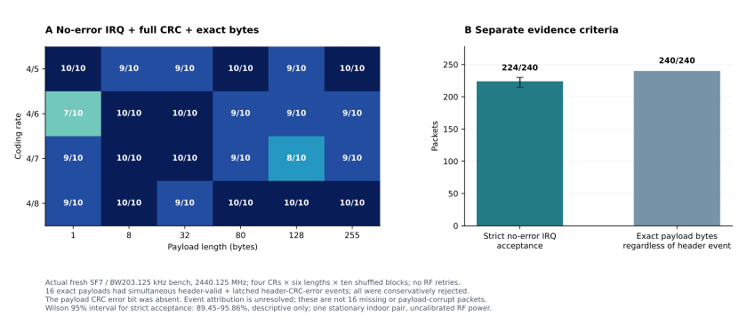
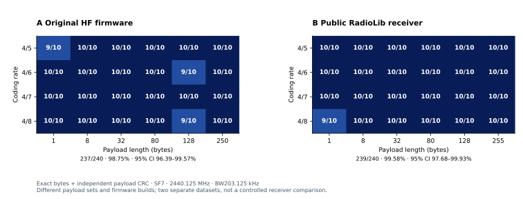
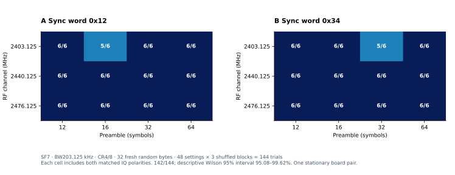
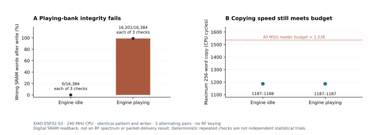
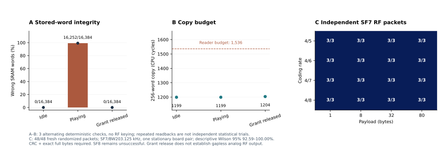
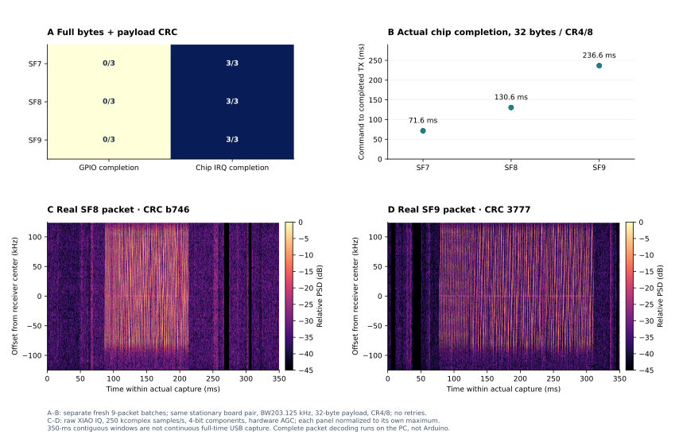
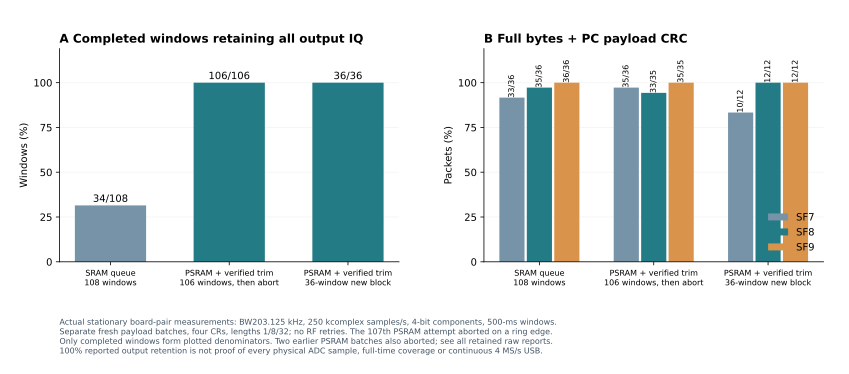
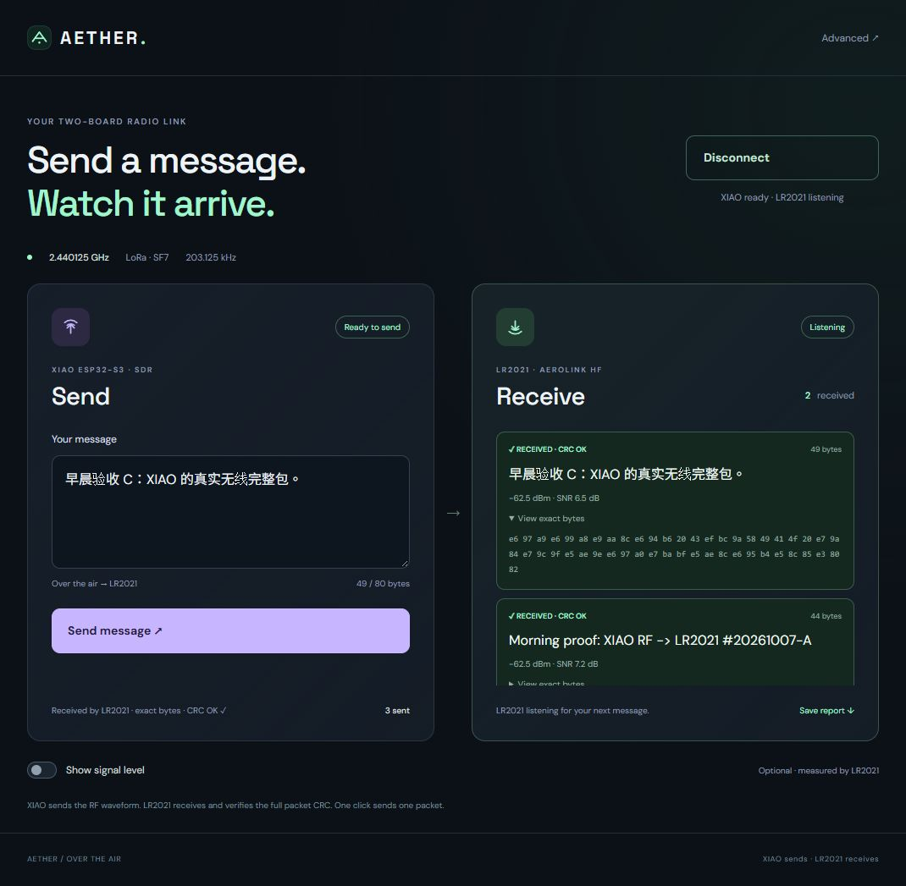

# 通宵测试摘要：2026-10-07

**XIAO ESP32-S3 已经用自带射频发出完整 2.4 GHz LoRa 包，LR2021 HF 接收、
硬件 CRC 通过、完整 payload 逐字节一致。** 发射编码和调制在 XIAO 上完成，
电脑只提供要发送的字节。它已经是一条真实的无线链路。

私人仓库：[jimmywuhkust/esp32-lora-sdr](https://github.com/jimmywuhkust/esp32-lora-sdr)。
源码、入门示例、独立公开接收器、英文及中文说明、原始成功/失败数据和
SVG/PNG/PDF 图表均放在仓库中。没有上传私有 AeroLink 源码包或真实 GNSS 数据。
这是工程实验报告，**不是已发表论文，也不是普通 LoRa 芯片全部功能的替代品**。

最新收尾矩阵：**240/240 全部 payload 字节一致；224/240 通过更严格的芯片 IRQ 验收**。另16次有累积包头CRC错误事件，保守拒绝，见文末审计。

## 已完成的真实测试

| 测试 | 结果 | 范围与解释 |
|---|---:|---|
| 最新严格 IRQ 接收器矩阵 | 224/240 | 全240份payload字节一致；16份含包头CRC错误事件被保守拒绝 |
| 原始独立接收器矩阵 | 237/240 | SF7、四种 CR、1–250 字节；三个失败保留 |
| 较早公开接收器/API验收 | 239/240 | SF7、四种 CR、1–255 字节；40 个 255 字节包全部通过 |
| SF7 / BW406.25 kHz | 72/72 | 四种 CR、六种长度；较短独立批次 |
| SF7 / BW812.5 kHz | 72/72 | 四种 CR、六种长度；较短独立批次 |
| 频点/前导码/同步字/IQ 极性矩阵 | 142/144 | 48 档 × 三个新随机载荷；两次 CRC 错误原样保留 |
| 模拟增益研究，DAC 幅度固定 | 70/70 | 七档未公开寄存器码 × 十个随机区组；不是校准 dBm |
| 最低模拟增益合入后的回归 | 72/72 | 四种 CR、1–255 字节；与先前研究重复载荷，不能合并统计 |
| 最新串口例程默认档冒烟 | 3/3 | 新固件、32 字节、完整独立硬件 CRC |
| 简单网页 + 公开接收器 | 2/2 | 新发送的英文16字节、中文38字节，硬件 CRC 与完整字节匹配 |
| SendOnce 入门例程 | 较早 3/3；后来 2/3 | 两个不同镜像；后一次漏收保留，没有重发补成成功 |
| 板上编码器交叉检查 | 264/264 | SF7–12、四种 CR、11 种长度；编码检查不等于无线互通 |
| 最新参数/时长/窗口保护检查 | 24/24 | 无效输入和不支持组合在播放前拒绝 |
| 电脑接收解码回归 | 7/7 | 真实SF7/8/9 IQ，以及合成信号、CRC、截断、传输损坏和采样间隙检查 |
| 最新独立接收固件的反向矩阵 | 104/108 | LR2021 发 → XIAO 采集 → 电脑完整解码；SF7/8/9、四种 CR、1/8/32字节 |

以上批次使用不同镜像或不同条件，**不要加在一起算一个总成功率**。
全部无线测量只来自同一对静止室内测试板，不证明距离、灵敏度或量产一致性。
公开接收器 239/240 的描述性 Wilson 95% 区间为 97.68–99.93%；
参数矩阵 142/144 的区间为 95.08–99.62%。小格子只有三次，不能据此保证每档可靠。

新矩阵覆盖 2403.125 / 2440.125 / 2476.125 MHz、前导码 12 / 16 / 32 / 64、
sync0x12 / 0x34，以及两种匹配的 IQ 极性。两次错误都出现在 2403.125 MHz、
标准接收极性：前导码32/sync0x34 和前导码16/sync0x12。收到的损坏字节及
CRC 错误在原始 JSON 中可查；本地 TX 正常、迟到计数为零，具体 RF 原因尚未证明。
第一轮因 OneDrive 写日志异常在 50/50 时中止，另存为未完成批次；修正日志方式后
用不同种子重新完成 144 次。没有把中止批次混入最终结果。

恢复旧私有 HF2 固件时，空闲出现一个被标成 CRC 正确的全 FF 报告，且没有
对应的新发送。原因尚未证明，原始状态保留；它从未满足我们的逐字节发送验收。
简单网页已改为只显示当前 XIAO 的匹配 TX/RX 事务，并接入公开接收器的显式
包头/CRC 元数据。现在板上运行公开接收固件；可选信号图显示新包的 RSSI，
不是连续 FFT，也不会把轮询旧值画成新采样。相关桥接软件测试 11/11 通过。

## 仍未完成的能力

- **稳定 SF8/SF9：** DAC 测试失败；另一条 PLL 路径收到过完整包，但小批次
  只有 SF8 1/10、SF9 4/10，不能当作可靠支持。
- **降功率收不到，再提高 SF 恢复：** 尚未得到这样的真实证据。
  数字幅度变化同时改变量化质量，模拟增益码也不单调，不能冒充可控衰减实验。
- **校准发射功率、距离、灵敏度：** 未测；LR2021 的 RSSI 不是 XIAO 发射功率。
- **无间隙连续发射：** 当前可靠路径每个 chirp 播放一段并留出 SRAM 复制间隙，
  默认 SF7 上行 chirp 覆盖约 59.5%。不能宣称连续完整波形。
- **原生 Arduino 完整包接收：** 未实现。反向链路是 XIAO 捕获 IQ、电脑完整解码。
  已有实时随机矩阵104/108，另有SF7/8/9真实录音；解码仍在电脑上。
- **全时、4 MS/s、100% IQ 经 USB 到电脑：** 未实现。已有接收会话使用独立
  350 ms 窗口，60 秒会话的实际 RF 覆盖约 58.9%；窗口内部无丢点不等于全时覆盖。

## 从别人失败的实验学到了什么

不是世界首创。我们查阅并区分了 LoLRa、ESP-SDR、esp32-sdr-trx，以及
Wi-Lo、WiRa、WiLo、Wi-Lo++ 和 XFi 等原始论文/项目。它们的机制、硬件和
接收证据不同；没有把其他项目的距离或成功率说成自己的结果。
[完整调研及直接来源](prior-art.md)。

esp32-sdr-trx 的失败记录指出，播放引擎读取 SRAM 时，CPU/GDMA 写入可能损坏。
我们先把复制循环优化到低于预算，再在自己的 XIAO 上做了三组交替读回检查：
引擎空闲时每组 16,384 字全部正确，播放时每组 16,201 字错误。这个检查没有
开启 RF 发射。它证明了这条写入路径在播放中不能保持数据完整性，不能仅凭
“CPU 复制够快”就说连续发射可行；具体硅片原因和实际 RF 波形仍未测明。
失败研究代码和零收包记录都保留，未混入可用库。

## 现在怎样复现

1. 按[入门步骤](quick-start.md)编译并刷入 XIAO 的 `xiao-s3`。
2. 给 LR2021 刷入[公开接收器](../companion/lr2021/README.md)，使用已核实的 HF 接口。
3. 保持两侧默认 2440.125 MHz、BW203.125 kHz、SF7、sync0x12、显式包头和 CRC。
4. 串口输入 `DAC`，再输入 `TX 7 4 48656c6c6f2066726f6d205849414f21`。
   这只发一个 `Hello from XIAO!`；接收端必须 CRC 正确且 hex 完全一致。
5. 按[自动验证说明](../evaluation/README.md)运行随机矩阵，关闭其他串口程序。
6. 不接硬件也可运行[电脑解码示例](../host/README.md)，直接复现真实反向录音。

默认 +15 kHz 修正只针对这一对板测得，其他设备需要重新测量。其他 ESP32 型号、
其他 Arduino core、未测试参数和监管认证均不能由这些结果推导。

镜像 SHA256、逐包原始数据、没有成功的实验、方法及所有图表来源见
[英文详细报告](test-report.md)。源码的云端编译成功与真实 RF 收包证据分开记录。

## 06:08 的进一步实验：参考失败案例后取得新进展

上游 DESIGN-IQ-TX 留下的问题是：CPU 写 SRAM 时临时撤掉射频访问权限，
能否避免播放中写坏数据？我们做了三组交替的无 RF 检查：空闲0/16,384错误，
播放16,252错误，临时撤权限后0错误；最大复制耗时仅从1,199变成1,204周期。
完成时间也基本相同。但数字读回正确不能证明天线输出连续。

把权限切换接入实际连续填充实验后，SF7 先收到3/3完整包，另一轮全新随机矩阵
又通过 **48/48**：四种纠错率、1/8/32/80字节、三个打乱顺序的区组。
每个包都要求硬件 CRC 和全部字节一致。48/48 的描述性 Wilson95%区间为
92.59–100%；每个参数格子只有三次。它仍是同一对室内静止板的有限实验。

SF8 在多种切换间隙下仍是0/3。增大复制块虽然降低迟到计数，却让SF7也0/3。
因此没有把实验路径直接合进正常库，也没有宣称无间隙 RF、全 SF 或远距离能力。
实验代码、实际镜像哈希和所有失败记录都已保留。

[实验说明与复现命令](../research/playing-bank-grant/README.md)。
最新已完成云端检查784d15f：Arduino编译和真实录音回归都通过，
[运行记录](https://github.com/jimmywuhkust/esp32-lora-sdr/actions/runs/37536431334)。
云端编译、数字 SRAM 检查、实际无线收包是三种不同证据，报告分别记录。

## 新的反向实时实验与公开接收工程

公开 LR2021 发射固件最初报告 TX成功，但两个实际批次都0/9。GPIO14在芯片IRQ
为零时也读到高，公开库的阻塞发送依赖它，因而不能拿这个判断真正发完。
改用芯片实际TX_DONE后，先完成9/9；另一批只改IRQ判断、保持原FIFO行为，
也9/9。没有把“打印发完”当作无线成功，每个包仍由XIAO真实IQ独立验收。

中途有未完成的主机超时批次，还有一批真实IQ解出9/9，但串口确认行截断，
严格验收只算8/9。读取器已修正，原失败记录没有删除。公开固件的另一个
350ms批次8/9；500ms新批次9/9。漏包原因尚未证明，不把换窗口当灵敏度对比。

我们现在把**独立ESP-IDF接收工程、固定依赖、公开LR2021发射例程、实时脚本**
都放进仓库。新工程重新编译、完整刷入XIAO并验证后，350ms冒烟8/9；随后
新的108次随机矩阵得到 **104/108**：SF7 **33/36**，SF8 **35/36**，SF9 **36/36**。
覆盖四种CR、1/8/32字节，每个参数三次，不重发补分。四个漏收均保留。
这是同一对静止室内板上的有限实验，不能推导距离、灵敏度或量产一致性。

这个500ms矩阵里只有34/108个窗口保留了全部IQ；另74个窗口报告一帧输出丢失。
采样保留率99.18–100%，解码器按实际采样间隙分段。**完整包解码成功和100%
采样是两回事。** 正在另测PSRAM缓冲，尚未把大缓冲当成USB吞吐量提高的证据。

图里的频谱来自真实录音，各面板单独归一化，不是校准功率。现在下载仓库可
直接重放SF7/8/9录音；七项电脑回归检查通过。需要新收包时，按
[接收固件说明](../firmware/iq-capture/README.md)和[实时命令](../host/README.md)复现。
解码依然在电脑上；原生Arduino完整收包、稳定XIAO高SF发射、弱信号提高SF
恢复和全时4MS/s USB仍未完成。

另外，双SRAM交替实验也完成独立48/48 SF7矩阵，复制耗时低于播放预算、
源数据FNV前后相同，但SF8仍失败。它没有被合进正常发射库，也没有宣称
天线输出无间隙。实验源码、固件哈希和所有失败批次已保存。

## 早晨补测：缓冲、原始 IQ 与边界失败

PSRAM 256 KiB 缓冲在这块已核实有 8 MB OPI PSRAM 的 XIAO 上消除了已完成
窗口的输出丢帧。但两轮长测试先后在第23、第11次采集触发边界错误。
第一轮旧脚本没有保存中止那一次的输入与部分 IQ；第二轮已保留。
这项证据缺口明确记录，没有事后补造数据。

新增的边界处理只允许剔除相邻银行中逐字相同的1–4个重复RF字；缺失或
不匹配仍中止。随后计划108次的批次完成106个窗口，完整包 **103/106**，
第107次仍在边界中止。106个完成窗口均报告100%输出采样保留、零输出丢帧。
中止的部分IQ、期望字节已保留，旧脚本漏存的发射诊断也明确注明。

又做一个全新随机种子的36次区组，得到 **34/36**，其中SF7 10/12、SF8 12/12、
SF9 12/12；36个窗口全部报告100%保留。不同批次没有相加或用重发补分。
这说明有限窗口内的缓冲改进有效，**长期无中断采样仍未解决**。

默认无PSRAM固件也在修改后重新构建、完整刷写，再用新的SF7/8/9包测试：
**9/9**完整CRC，但九个窗口仍各有输出丢帧。之前104/108属于之前的镜像，
不能套到新二进制上。两版接收固件都提供生成的二进制、源码/依赖哈希、
校验后刷机脚本，初学者不必先装完整SDK。没有放设备读回或NVS。

[真实IQ下载](../evaluation/data/captured-iq.zip)包括六个缓冲实验批次的成功、
漏收及已保存的部分录音；附逐文件SHA256。所有中止批次也在报告里。
这里是250 kcomplex samples/s的抽取输出；窗口内100%到达不是对每个物理ADC
采样的独立证明，更不是全时4MS/s无损USB。原生Arduino完整RX、高SF稳定TX、
校准发射功率和弱信号提升SF后恢复收包，依然没有完成。

## 最终接收器审计：先保留 IRQ，再判定完整包

恢复正式 XIAO 发射固件、刷入新的默认只收 LR2021 固件后，用新的随机种子
完整跑了240次：SF7、BW203.125 kHz、四种CR、1/8/32/80/128/255字节、十个区组。
结果 **240/240 payload 完全一致，224/240 通过更严格的 IRQ 验收**。
规则要求 RX_DONE、有效包头、没有包头/payload CRC错误位、CRC存在、读取与
包头API返回成功、长度和全部字节一致。16次拒收保留，没有重发补分。

16次的字节仍完全正确，API读取状态为0；IRQ为00040370或00040371，含第9位
**包头CRC错误事件**，没有第22位payload CRC错误。RadioLib7.7.0读取路径会
检查payload CRC和有效包头，但不单独拒绝这组同时存在的包头错误事件。
IRQ是累积事件，可能先有错误候选包头再收到有效包；还不能证明那份正确
payload的自身包头损坏。因此224/240不能解释成16个漏包或payload损坏。
新接收器保守拒绝这个含糊状态，并保留诊断。

旧239/240等批次按当时API状态/CRC存在/完整字节验收，没有保存这组完整IRQ；
不能事后补判成今天的规则，也不能因新旧随机批次不同就推导发射性能下降。
最新224/240的描述性Wilson95%区间为89.45–95.86%，仍只是这对室内静止板的结果。
[逐包原始记录](../evaluation/data/public-receiver-final-irq.json)及
[失败编号/计数](../evaluation/data/public-receiver-final-irq-summary.json)已保存。

## 网页收尾验收与设备现状

最终网页新发三份不同载荷，**2/3**通过：英文44字节、中文49字节，完整字节
匹配、CRC通过。另一份中文56字节虽然收到正确字节，却被严格接收器拒绝；
没有删除或重发补成成功。它和最早网页2/2是不同镜像/不同批次。
网页保存接收行和拒绝行，未单独保留RX_IRQ；完整IRQ审计见240包矩阵。
[完整网页证据](../evaluation/data/final-web-proof.json)。

COM3已恢复XIAO正式Arduino发射固件，COM4运行新默认LR2021只收固件。
本地9173网页保持连接，直接输入消息按Send即可；没有后台周期发射。
英文/中文说明、Arduino与PlatformIO例程、公开接收器、接收预编译固件、
原始IQ、逐包成功/失败和SVG/PNG/PDF图表都已整理。完整双向原生Arduino库、
稳定高SF发射、校准功率及弱信号SF恢复实验仍未完成，不能宣传为全功能LoRa芯片替代品。
